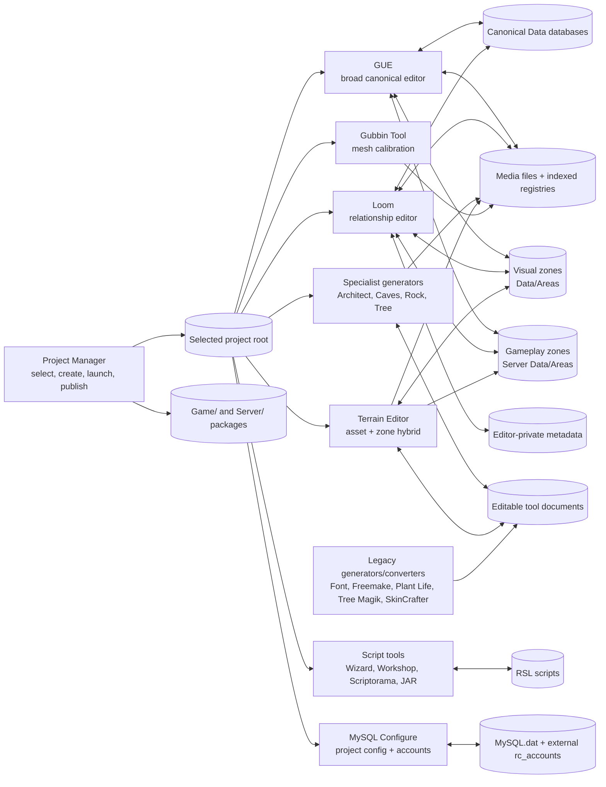

# RCCE2 editor suite: descriptive master specification

- **Status:** discovery baseline for greenfield design handoff
- **Research snapshot:** 2026-07-20
- **Scope:** every repository or bundled application that authors, organizes, previews, exports, or packages an RCCE project, excluding the gameplay behavior of the Server and Client applications
- **Audience:** the agent or team that will design a single successor editor
- **Nature of this document:** descriptive, not prescriptive

## 1. Purpose

RCCE2 does not have one editor. It has a collection of applications that overlap on a shared project tree:

- Project Manager selects projects, creates them from a template, launches the other applications, edits project identity, and publishes distributable trees.
- GUE is the broad legacy editor and the only application that exposes nearly every canonical game-data domain plus the complete paired visual/gameplay zone model.
- Loom is a newer relationship-oriented editor. It directly edits much of the same canonical data, adds navigation, validation, history, search, and project-health surfaces, and exposes a deliberately narrower world-editing envelope.
- Six source-built specialist tools create or calibrate reusable meshes; Terrain Editor also rewrites zone state.
- Several bundled, source-absent tools generate scripts, fonts, vegetation, trees, or other assets. Some write into a selected project, some export into their own folders, and some are opaque.

The suite is therefore best understood as a **state atlas**. The durable files are the terrain; each application is a different lens over it. This specification records what those lenses reveal or mutate, where state is duplicated or shared, and which behaviors are confirmed versus inferred. It intentionally does not choose a UI, framework, storage migration, architecture, or implementation sequence for a replacement.

## 2. Evidence model and snapshot

Claims use these evidence levels:

| Label | Meaning |
|---|---|
| **Inspected source** | Behavior is directly present in repository source. |
| **Inspected artifact** | Behavior is supported by bundled documentation, templates, sample outputs, JAR contents, or static executable strings; source is unavailable. |
| **Executed/observed** | A read-only command was run and its output observed. No editor executable was launched for this survey. |
| **Inferred** | The consequence follows from multiple inspected facts, but was not exercised at runtime. |
| **Unknown** | The available static evidence is insufficient. |

On 2026-07-20 at research start, the inspected working tree was local `develop` at `21f167c7c80e5e3bf57ab0c19a821f4cf5f2f0f1`. It contained extensive pre-existing changes and was 108 commits behind the then-local `origin/develop` at `af95f8cf`. By closeout the remote-tracking ref was `4b609b673a5e4648193566f60038080807f36a2d`, 110 commits ahead; the two intervening commits only link Loom documentation and do not alter this capability map. This research did not switch branches or modify project data. Relevant newer Loom behavior was reconciled from `origin/develop`, particularly:

- `a2136cb2`: persistence failures retain Loom dirty state and block save-and-exit;
- `c9e83096`: spatial marker dragging preserves semantic Y independently of display lift;
- `93a50f23`, `a5eb1e46`, `f8aa4ea9`, and `990ced04`: category and preview documentation corrections;
- `12c0d5e6` and `17b9b2cf`: bounded safety fixes that do not materially change the capability map.

Unless a finding is explicitly called local-only, the description reflects the newer behavior where these commits differ. Line links point into the inspected checkout, so upstream-only corrections are identified by commit as well as path.

## 3. Scope and application inventory

### 3.1 In-scope applications

| Application | Provenance | Primary role | Direct project-state effect |
|---|---|---|---|
| Project Manager | Source-built | Project discovery, creation, launch, identity, publication | Creates `Data`, edits project name, tracks recent roots, rebuilds `Game` and `Server` packages |
| GUE | Source-built | Broad canonical data and 3D world editor | Reads and writes nearly every canonical database and both halves of a zone |
| Loom | Source-built | Relationship-oriented canonical data editor and project browser | Reads and writes many GUE formats; also writes Loom-only navigation metadata |
| Gubbin Tool | Source-built | Attachment-mesh calibration | Changes shared mesh scale/offset and can bake rotation into B3D geometry |
| RC Architect | Source-built | Composite/prefab mesh authoring | Saves `.act`; exports and registers a composite mesh |
| RC Caves Editor | Source-built | Boolean cave-mesh authoring | Saves cave/light work files; exports and registers a cave mesh |
| RC Rock Editor | Source-built | Procedural rock generation | Exports and registers a rock mesh |
| RC Terrain Editor | Source-built | Layered terrain and vegetation authoring | Saves `.rct`; exports/registers terrain; rewrites visual zone and may create gameplay-zone shell |
| RC Tree Editor | Source-built | Procedural trunk/leaf tree authoring | Saves `.fte`; exports and registers a tree mesh |
| RC Spell Wizard | Bundled binary | Spell-script scaffold generation | Generates RSL content; exact direct-write behavior is not statically confirmed |
| Script Crafters Workshop | Bundled binary | Script and content scaffold generation | Static evidence identifies direct saves under the selected project's Scripts folder |
| RC Scriptorama | Bundled .NET binary | Multi-project RSL editor and reference browser | Static evidence identifies direct open/save/delete activity in project Scripts folders |
| Font Generator | Bundled binary + README | Bitmap font atlas/metrics generation | Produces files intended for manual copy into `Data\UI\Fonts` |
| Freemake Audio Converter | Bundled third-party application | Bulk conversion of source audio to OGG | Produces importable audio bytes; no direct RCCE registration or project model is evidenced |
| Plant Life | Bundled binary + samples | Procedural vegetation/rock generation | Exports assets under its own bundle; no direct project registration is evidenced |
| Tree Magik | Bundled binary + samples | Procedural tree generation | Saves/exports within its own bundle; no direct project registration is evidenced |
| RC Script Generator | Bundled Java JAR | Legacy script generation | No direct project write; generated RSL is copied to the clipboard for manual paste/save |
| RC SkinCrafter | Bundled compressed binary | Legacy utility of unknown effective scope | No project formats or mutations were recoverable statically |
| MySQL Configure | Bundled .NET binary under `extras` | Database configuration and account administration | Writes project `MySQL.dat` and mutates external `rc_accounts` rows |

The build scripts compile exactly six top-level tool sources under `src/Tools`; Loom's seven launch cards are those six plus the source-absent Spell Wizard ([`compile.bat`](../compile.bat#L89), [`compile.sh`](../compile.sh#L122), [`Tools.bb`](../src/Modules/Loom/Tools.bb#L43)). The bundled directory contains additional applications that are neither built nor consistently wired into a current launcher.

### 3.2 Explicit boundaries

- Server and Client gameplay/runtime capabilities are outside scope. Their data-consumption contracts are included only when they explain an editor field or persisted format.
- BlitzForge and the `blitzcc` compiler are build infrastructure, not project-content editors. Project Manager can launch the compiler, but it does not mutate RCCE project content through an editor model.
- Publish is included because it is a Project Manager mutation of project-root output trees, even though the resulting packages contain Server and Client binaries.
- Historical code with no active UI path is labeled dormant rather than counted as current functionality.
- The React/HTML Loom prototype describes intent, not shipped behavior. It is context for design lineage, not evidence that a capability exists.
- MySQL Configure is included as an adjacent administrative surface because it mutates project configuration and account state. The bundled MySQL BVM Server remains excluded as a server.

Other executable artifacts were inspected at the inventory boundary and are not project editors:

- BlitzForge/BlitzRC/Protean IDEs and the VS Code extension edit or build source code rather than project content;
- ReShade Setup and `dgVoodooCpl.exe` configure Client-side rendering wrappers;
- FFmpeg/ffprobe, `dboplug.exe`, updater/uninstaller programs, samples, and demos are helpers or third-party components rather than separate authoring surfaces.

## 4. The suite as a project-state system

This graph exposes the suite's central distinction:

1. **Canonical records** are the data structures loaded by the game and shared by GUE and Loom.
2. **Physical assets plus registries** separate bytes on disk from their numeric media identities.
3. **Zones are paired documents**: a visual file and a gameplay file share a filename but not a transaction.
4. **Specialist source documents** preserve editable construction state that is not present in the exported runtime mesh.
5. **Editor-private metadata** affects authoring continuity but not gameplay.
6. **Published outputs** are rebuilt projections of selected project and installation content.

Project identity is generally implicit in process working directory rather than passed as a manifest or explicit project argument. Installation assets/binaries and selected-project data can therefore have different roots. **Inspected survey result:** each application loads its own project snapshot, and no project-lock, shared-edit-session, or cross-process reload-notification mechanism was found in the surveyed Project Manager, GUE, Loom, or specialist-tool entry points ([`Project Manager.bb`](<../src/Project Manager.bb#L522>), [`GUE.bb`](../src/GUE.bb#L1), [`Loom.bb`](../src/Loom.bb#L41)). Maintained BlitzForge editors and most legacy adjuncts are Windows-oriented, while the Java generator is portable at the artifact level.

## 5. Project-state atlas

### 5.1 Durable state families

| State family | Principal paths | Identity / shape | Editors and effects |
|---|---|---|---|
| Project identity | `Data/Game Data/Misc.dat` | Ordered scalar fields; first three lines include name/update values | PM edits project name; GUE/Loom edit broader settings |
| Hosts and client options | `Data/Game Data/Hosts.dat`, `Other.dat` | Mixed full-file and fixed-offset legacy formats | GUE writes many options immediately; Loom batches them in Settings |
| Server options | `Data/Server Data/Misc.dat` | Fixed-offset legacy file | GUE immediate mutations; Loom Settings rewrite |
| Currency | `Data/Game Data/Money.dat` | Four names and conversion multipliers | GUE immediate; Loom deferred Settings |
| Damage model | `Data/Game Data/Combat.dat`, `Data/Server Data/Damage.dat` and settings offsets | Twenty damage names plus combat policy | GUE splits deferred names from immediate policy; Loom exposes names in Settings |
| Attributes | `Data/Server Data/Attributes.dat`, `Data/Game Data/Fixed Attributes.dat`, server counterpart | Forty indexed attributes plus six semantic role mappings | GUE edits catalog and mapping modal; Loom edits catalog/assignment settings but not the full mapping surface |
| Factions | `Data/Server Data/Factions.dat` | 100 indexed names plus 100 x 100 directed relation matrix | GUE and Loom edit; references from actors |
| Actors | `Data/Server Data/Actors.dat` | Fixed indexed actor templates | GUE and Loom edit; zones refer by actor ID |
| Items | `Data/Server Data/Items.dat` | Fixed indexed item templates | GUE and Loom edit; refers to media, projectile, damage, attributes, scripts |
| Spells/abilities | `Data/Server Data/Spells.dat` | Fixed indexed ability templates | GUE and Loom edit; script tools author referenced RSL |
| Projectiles | `Data/Server Data/Projectiles.dat` | 5,001 indexed projectile slots | GUE and Loom edit; items refer by projectile ID |
| Animation sets | `Data/Game Data/Animations.dat` | 1,000 indexed sets, each with up to 150 clips | GUE and Loom edit; actors refer by set ID |
| Calendar and seasons | `Data/Server Data/Environment.dat` | Year/day/time, 20 months, 12 seasons | GUE and Loom edit |
| Suns and moons | `Data/Game Data/Suns.dat` | Variable roster with phase and per-season timing | GUE and Loom edit; media texture references |
| Interface layout | `Data/Game Data/Interface.dat` | Normalized component rectangles, color/alpha, texture IDs | GUE and Loom edit |
| Media registries | `Data/Game Data/{Meshes,Textures,Sounds,Music}.dat` | Large indexed catalogs separate from asset bytes | GUE, Loom, all source-built generators, Gubbin Tool |
| Physical media | `Data/{Meshes,Textures,Sounds,Music}/...` | Files named by registry records | Imported/exported/copied/deleted by different tools with different semantics |
| Prepared external audio | User-selected Freemake outputs | OGG bytes with no RCCE catalog identity until import | Freemake converts; GUE later copies/registers |
| Particle emitters | `Data/Emitter Configs/*.rpc` | One named file per emitter configuration | GUE and Loom edit; projectiles and zones refer by name |
| Visual zones | `Data/Areas/<zone>.dat` | One whole-file visual document per zone | GUE full editor; Loom limited world/scenery editor; Terrain hybrid serializer |
| Gameplay zones | `Data/Server Data/Areas/<zone>.dat` | One whole-file gameplay document per zone | GUE full editor; Loom gameplay editor; Terrain may create default shell |
| Scripts | `Data/Server Data/Scripts/*.rsl` | Filename and function-name references | GUE discovers methods; Loom reads/searches; binary adjuncts edit or generate |
| Database configuration/accounts | `Data/Server Data/MySQL.dat`; external `rc_accounts` table | Connection settings plus database-owned account IDs/rows | MySQL Configure writes config and performs account administration |
| Gubbin joint names | `Data/Game Data/Gubbins.dat` | Six named attachment bones | GUE edits; Gubbin Tool reads as preview context |
| Specialist source | `Data/Architect/Saves/*.act`, `Data/RCCAVES/*`, `Data/RCTE/RCTE_SAVED/*.{rct,mbr}`, `Data/RCTREES/.../*.fte` | Tool-specific editable documents and reusable Terrain brush palettes | Their respective specialist tools |
| Specialist settings | `Data/RCTE/Settings.dat` | Terrain Editor billboard-mode preference | Terrain Editor loads at startup and atomically writes on confirmed exit |
| Loom metadata | `Data/Loom/{recents,atlas,chrome}.txt` | Project-local navigation/layout/presentation state | Loom only; gameplay-neutral |
| Recent projects | installation `res/Recent.dat` | Up to ten normalized project roots | Project Manager only |
| Published projections | project-root `Game/`, `Server/` | Destructively rebuilt package trees | Project Manager publish |

Most canonical collection writers use the shared safe-write pattern: write a temporary file, retain a backup, validate that the temporary file is non-empty, promote it, and attempt rollback on failure ([`Logging.bb`](../src/Modules/Logging.bb#L5)). That protects a single file. It does not make a multi-file action—such as Settings, Environment plus Suns, or paired zone save—transactional as a unit.

### 5.2 Identity, capacity, and reference contracts

| Domain | Existing identity/capacity | Consequence visible to editors |
|---|---|---|
| Actors | Numeric slots `0..65535` | References persist as actor IDs; empty slots are meaningful |
| Items and spells | Numeric IDs `0..65534`; `65535` is the none/invalid sentinel | Deletion leaves IDs available for reuse; references are not automatically repaired |
| Projectiles | Numeric slots `0..5000` | Ranged items store projectile IDs |
| Animation sets | Numeric slots `0..999`; up to 150 clips each | Actors store male/female set IDs; clip names are secondary identity |
| Factions | Numeric slots `0..99`; directed 100 x 100 matrix | Removing or duplicating a name is not equivalent to copying/remapping its relations |
| Attributes | Numeric slots `0..39` | Actor values, item modifiers, UI bars, and semantic mappings share the index |
| Damage types | Numeric slots `0..19` | Items, projectiles, water damage, and actor resistances share the index |
| Media | Fixed indexed catalogs of 65,535 records | The registry ID, stored relative filename, and physical file are distinct identities |
| Particle emitters | `.rpc` basename | Projectile and zone references are name-based |
| Zones | Filename-derived name; no global numeric ID | Rename, copy, delete, portal links, weather links, and paired-file ownership are coupled to text identity |
| Zone triggers | 150 fixed slots per gameplay zone | Empty slot versus populated record controls visibility |
| Zone waypoints | 2,000 fixed slots per gameplay zone | Spawn positions are indirect through waypoint indices |
| Zone portals | 100 fixed slots per gameplay zone | Links combine destination zone and destination portal names |
| Zone spawns | 1,000 fixed slots per gameplay zone | Actor ID plus waypoint, population, timing, range, and scripts form one spawn definition |
| Scripts | Relative filename plus method/function text | Editors use loose source scanning rather than a compiled symbol table |
| Loom focus | Runtime handles plus type-specific stable keys | Handles are session-local; Recents re-resolves only supported kinds |

The project graph mixes four reference styles: numeric IDs, filenames/basenames, display names, and runtime object handles. The current applications do not impose global referential integrity. Picker refreshes, broken-reference reports, and limited cleanup paths improve visibility, but most delete and rename operations can leave dangling stored references.

### 5.3 Persistence modes

| Mode | Existing examples | Observable semantics |
|---|---|---|
| Deferred full-collection save | Actors, Items, Spells, Factions, Projectiles, Animations | Many in-memory edits share one dirty flag and one whole-file write |
| Immediate catalog mutation | GUE/Loom media add/remove/scale | Registry changes are outside Save All and exit prompts |
| Immediate fixed-offset mutation | Several GUE settings | A control event writes directly into an existing legacy file |
| One file per named entity | Particle `.rpc`, each zone half | Creation/deletion can happen independently of other in-memory changes |
| Paired whole-file zone save | visual and gameplay area files | The same logical zone spans two serializers without a cross-file transaction |
| Export plus registration | Architect/Caves/Rock/Tree/Terrain | A physical mesh and a `Meshes.dat` record are separate outputs |
| Destructive asset calibration | Gubbin rotation bake | Existing mesh bytes change in place after backup-oriented promotion |
| Private editable source | `.act`, `.rct`, `.mbr`, `.fte`, cave B3D/LGT | Runtime export cannot reconstruct the full authoring document or reusable brush palette |
| Manual integration | FontGen, Plant Life, Tree Magik | Generated output remains outside the project until a later copy/import step |
| Destructive package rebuild | Project Manager Publish | Existing package directories are removed and recreated from current sources |

## 6. GUE: broad canonical and world editor

### 6.1 Role and operating model

GUE is a project-root-relative application rather than a project chooser. It expects a launcher to set the child working directory to the selected project's `Data` folder, moves to its parent, and then addresses `Data\...` ([`GUE.bb`](../src/GUE.bb#L1)). At startup it loads interface state, particle configurations, settings, damage types, attributes, factions, animation sets, projectiles, items, actors, spells, every gameplay area, Environment, and Suns ([`GUE.bb`](../src/GUE.bb#L255)).

Its main window contains 15 tabs: Project, Media, Particles, Combat, Projectiles, Factions, Animations, Attributes, Actors, Items, Days & seasons, Zones, Abilities, Interface, and Other ([`GUE.bb`](../src/GUE.bb#L366)). Project is informational, leaving 14 active editing surfaces.

GUE discovers `.rsl` scripts by scanning filenames and source text. Prefixes such as `Trigger_`, `Spawn_`, `Click_`, `Death_`, `Entry_`, `Exit_`, `Item_`, and `Spell_` determine which pickers see a file. Method discovery scans lines containing `FUNCTION` and uses the text before `(` rather than a parsed symbol model ([`GUE.bb`](../src/GUE.bb#L2116), [`GUE.bb`](../src/GUE.bb#L7233)).

### 6.2 Capability by surface

#### Project

The surface shows welcome/project identity information. A Restore Language control is commented out; a dormant event path would generate `Data\Game Data\Language Restore.txt`, but this is not a current UI capability ([`GUE.bb`](../src/GUE.bb#L398), [`Language.bb`](../src/Modules/Language.bb#L331)).

#### Media

GUE owns the broadest current media-import workflow. It browses Mesh, Texture, Sound, and Music catalogs and folders; imports a file or recursively imports a folder; previews registered content; removes registration; optionally removes the physical project file; and edits mesh initial scale ([`GUE.bb`](../src/GUE.bb#L407), [`Media.bb`](../src/Modules/Media.bb#L37)).

- Mesh import accepts B3D, X, 3DS, and OBJ, records animated/static intent, and copies the source into project media.
- Texture import records color, alpha, mask, mipmap, clamp, sphere, and cube flags. The single-file picker advertises DDS while the recursive importer recognizes BMP/JPG/PNG/TGA, an existing format-list mismatch.
- Sound and music use OGG; Sound additionally stores a 3D/spatial flag.
- Mesh and texture selections render in a preview area; mesh can be rotated.
- Sound and music expose Play, Stop, and volume. This working audition surface contradicts older comments that describe GUE as lacking audio preview ([`GUE.bb`](../src/GUE.bb#L6530)).

Registration and removal are immediate media-database changes and are not part of GUE's dirty/save prompt. Physical deletion is a second, confirmed action after catalog removal.

#### Particles

The particle editor creates, previews, edits, saves, and deletes named emitter configurations. Its complete field envelope is:

- maximum particles, spawn rate, lifespan, initial size, and size change;
- blend mode, alpha, and alpha change;
- initial RGB and per-channel change;
- texture, grid dimensions, animation speed, and random start frame;
- sphere, cylinder, or box emission shape, axis, dimensions, inner/outer radii;
- velocity shaping, XYZ vector, and randomization;
- force shaping, XYZ force vector, and force modifiers.

Each emitter is a separate `Data\Emitter Configs\<name>.rpc`; the type and full atomic serializer are in [`RottParticles.bb`](../src/Modules/RottParticles.bb#L49) and [`RottParticles.bb`](../src/Modules/RottParticles.bb#L1121). GUE exposes New and Delete but no Copy control, even though a module-level full-copy routine exists. Changing only an emitter texture does not mark the particle domain dirty in the inspected UI event path.

#### Combat

Combat exposes 20 damage-type names, combat delay, weapon and armour contribution toggles, four damage-formula modes, three damage-information display styles, and faction-rating adjustment ([`GUE.bb`](../src/GUE.bb#L635)). Damage names use deferred full-file save. The remaining controls immediately edit fixed positions split between server `Misc.dat` and game `Other.dat`, so one visible surface has two persistence semantics.

#### Projectiles

A projectile records name, mesh ID, two emitter names, two emitter texture IDs, homing, hit chance, damage, damage-type index, and speed. GUE supports New, Copy, Delete, field editing, and Save ([`GUE.bb`](../src/GUE.bb#L686), [`Projectiles.bb`](../src/Modules/Projectiles.bb#L1)). Deletion does not scan or repair ranged items that store its ID.

#### Factions

The editor manages 100 faction slots and a directed 100 x 100 relationship matrix. It supports add, rename, delete, and rating mutation while showing both directions of a selected relationship. The UI's `-100..100` rating is stored with an offset in the byte-oriented matrix ([`GUE.bb`](../src/GUE.bb#L751), [`Actors.bb`](../src/Modules/Actors.bb#L1267)). A “limit 50” message is stale relative to the 100-slot implementation.

#### Animation sets

Each of 1,000 slots can hold an animation set with up to 150 clips. Each clip has name, start frame, end frame, and speed. GUE supports New, Copy, Delete, field edits, and Save ([`GUE.bb`](../src/GUE.bb#L774), [`Animations.bb`](../src/Modules/Animations.bb#L1)). The GUE copy path copies name/start/end but omits clip speed, although the module's canonical copy helper includes it. The authoritative file is atomic; a non-authoritative debug text file is also emitted by the save routine.

#### Attributes and fixed mappings

The attribute catalog has 40 slots. GUE edits name, Skill, Hidden, and the character-creation assignment pool. A separate modal maps six semantic roles—Health, Energy, Breath, Toughness, Strength, and Speed—to attribute slots ([`GUE.bb`](../src/GUE.bb#L802), [`Actors.bb`](../src/Modules/Actors.bb#L1071)).

The catalog is deferred and atomically saved. The semantic mapping modal writes immediately. Its server mapping contains all six roles, while the game/client-side mapping write omits Toughness in the inspected path ([`GUE.bb`](../src/GUE.bb#L10005)).

#### Actors

Actor templates expose:

- race, class, description, enabled genders, and faction;
- aggression mode/range, trade mode, environment mode, playable, rideable, polygon collision, scale, and radius-related behavior;
- start zone and portal, XP multiplier, inventory-slot mask, and default damage type;
- male and female animation-set IDs;
- current and maximum values for 40 attributes and resistance values for 20 damage types;
- male/female base meshes; five hair choices per gender; five face and body textures per gender; five beard meshes; six gubbin meshes; blood texture;
- speech sound slots and a live 3D appearance preview.

GUE supports New, full Copy, Delete, editing, and Save ([`GUE.bb`](../src/GUE.bb#L823), [`Actors.bb`](../src/Modules/Actors.bb#L55)). The serializer writes 16 speech slots, while GUE constructs 12 controls. `HairColours` exists in memory but its shared serialization line is commented and GUE has no current surface for it.

Actor deletion scans loaded zones and clears matching spawn actor IDs. **Inferred:** the cleanup changes multiple loaded `Area` objects but the global dirty/save path persists only `CurrentArea`, so some cross-zone cleanup can remain only in memory ([`GUE.bb`](../src/GUE.bb#L5108), [`GUE.bb`](../src/GUE.bb#L9131)).

#### Items

Item templates expose:

- name, item type, equipment slot, value, and mass;
- stackable and damageable/breakable state;
- weapon damage, damage type, projectile, ranged animation, and range;
- armour rating or consumption/effect duration where applicable;
- thumbnail/image, male mesh, female mesh, miscellaneous data, and six gubbin flags;
- 40 attribute modifiers;
- race/class restrictions and `Item_` script/method.

GUE supports New, Delete, Edit, and Save, but no Copy control ([`GUE.bb`](../src/GUE.bb#L1088), [`Items.bb`](../src/Modules/Items.bb#L1)). Attribute modifiers use a storage bias. Save also emits a non-authoritative debug file. Delete does not repair foreign references.

#### Days, seasons, suns, and moons

The environment surface edits year length, time factor, current year/day, 20 month names and lengths, and 12 season names, lengths, dawn, and dusk. A variable roster of suns/moons adds texture or eight phase textures, phase length, size, path angle, light color, lens flare, and rise/set time per season ([`GUE.bb`](../src/GUE.bb#L1288), [`Environment.bb`](../src/Modules/Environment.bb#L1)). Calendar data and visual sun data persist to two separate atomic files.

#### Abilities

Abilities—named Spells in storage—contain name, description, icon texture, recharge time, race/class restrictions, and a `Spell_` script/method. GUE supports New, Delete, Edit, and Save ([`GUE.bb`](../src/GUE.bb#L1832), [`Spells.bb`](../src/Modules/Spells.bb#L1)). Delete does not repair other content that names the ability.

#### Interface

GUE previews an 800 x 600 normalized canvas and switches between Game and Inventory layouts. For each selectable component it edits normalized X/Y/width/height, RGB, and alpha; Chat additionally selects a background texture ([`GUE.bb`](../src/GUE.bb#L1880), [`Interface.bb`](../src/Modules/Interface.bb#L188)).

The Game surface includes Chat, Chat Entry, Radar, Compass, Buffs, and a display for each defined attribute. Inventory includes its window, Drop/Use/Money displays, equipment locations, and backpack buttons. Login and character-selection layout code remains commented and outside the current serializer.

#### Other

The Other surface edits update URL, server host and port, account-creation permission, maximum characters, starting money and reputation, force-portals policy, nametag policy, actor collision, camera/view mode, ability memorization, speech bubbles and color, four currency tiers, and six gubbin joint names ([`GUE.bb`](../src/GUE.bb#L1944)). These are immediate writes distributed across Hosts, `Misc.dat`, `Other.dat`, Money, and Gubbins rather than one deferred domain.

### 6.3 Zone editor: paired visual and gameplay authoring

The Zones tab is the suite's broadest spatial authoring surface. It provides New, Load, Save, Copy, Delete, Undo, selection, translation, rotation, scaling, precise numeric editing, a fly/orbit camera, placement modes, and whole-zone scaling ([`GUE.bb`](../src/GUE.bb#L1401)).

#### Visual object families

| Family | Existing manipulation |
|---|---|
| Scenery | Place registered mesh, select, move/rotate/scale, align to surface, duplicate, set animation/collision/weather-capture/lock/shadow behavior, delete |
| Native terrain | Create flat or import heightmap; edit height/color/detail maps, scale, detail scale, triangle layout, morphing, and shading |
| Particle emitter | Place emitter configuration with texture and transform |
| Water | Place and size volume; edit RGB, texture, texture scale, opacity; link gameplay damage/type |
| Collision box | Place, size, transform, and delete invisible collision volume |
| Sound/music zone | Place and size positional region; choose sound/music, repeat, and volume |
| Dynamic light convention | Place scenery whose mesh name follows `light_<range>_<r>_<g>_<b>`; runtime/editor code derives a point light |

The visual serializer writes the full zone environment plus Scenery, Water, Collision, Emitters, native Terrain, and Sound Zones to `Data\Areas\<name>.dat` ([`AreaLoader.bb`](../src/Modules/AreaLoader.bb#L1101)). Its own contract requires a fully loaded world because saving is a whole-file rewrite.

#### Gameplay object families

| Family | Existing manipulation |
|---|---|
| Trigger | Place volume with script/method context; move/size/delete |
| Waypoint | Place, move, link A/B, pause; host spawn anchor |
| Spawn | Actor, spawn/click/death scripts, frequency, maximum population, and range attached to waypoint |
| Portal | Name, destination area/portal, position, yaw, and volume |
| Zone policy | Weather probabilities/link, outdoors, fog/light, slope, gravity, entry/exit scripts, PvP, loading texture, music, map texture |

The gameplay serializer writes fixed arrays of 150 triggers, 2,000 waypoints, 100 portals, 1,000 spawns, plus zone policy and gameplay Water records to `Data\Server Data\Areas\<name>.dat` ([`ServerAreas.bb`](../src/Modules/ServerAreas.bb#L1), [`ServerAreas.bb`](../src/Modules/ServerAreas.bb#L449)).

#### Direct manipulation and history

Keyboard and viewport interaction include Ctrl+D duplicate, Ctrl+Z undo, Delete, F1–F4 transform modes, numpad camera controls, Tab object-family cycling, surface dragging, and waypoint linking. A precise-edit dialog changes XYZ, pitch/yaw/roll, and scale ([`GUE.bb`](../src/GUE.bb#L2258), [`GUE.bb`](../src/GUE.bb#L8457)).

Undo can reconstruct deleted Scenery, Terrain, Emitter, Water, Collision, and Sound objects and tracks a wider set of transforms/mode operations. Trigger, Portal, and Waypoint deletions enter the action log but have no corresponding reconstruction case. There is no Redo. Whole-zone scale explicitly cannot be undone.

Scenery Duplicate copies geometry, material IDs, scale, and transform but omits several persisted metadata fields such as animation, weather capture, shadows, render range, and lock. Some constructed Scenery controls—inventory/ownership and render-range/LOD behavior—have missing or commented mutation handlers in the inspected source.

#### Zone lifecycle and file ownership

- New and Load offer to save the current zone, then unload and replace in-memory visual/gameplay state.
- Copy temporarily assigns a new name and writes both files, then clones the gameplay `Area` data.
- Delete immediately removes both the visual and gameplay files.
- Save synchronizes marker proxies and water geometry, then runs both whole-file serializers ([`GUE.bb`](../src/GUE.bb#L9131)).
- Unload reloads gameplay state from disk and clears visual state, thereby discarding unsaved changes.

The save path marks the zone clean without checking either serializer outcome in the inspected source. Several mutations—including portal destination edits, some Scenery rain/shadow/lock controls, and particle texture selection—also bypass dirty marking. These are existing behavioral seams, not intended format semantics.

### 6.4 GUE save and exit behavior

GUE's deferred dirty model covers Items, Actors, Projectiles, Factions, Animation Sets, Attributes, Particles, Damage names, Environment/Suns, the current Zone, Abilities, and Interface. File > Save All serializes all of them, not only dirty domains ([`GUE.bb`](../src/GUE.bb#L10668)).

Media and most Other/Combat settings mutate immediately and do not appear in the save dialog. The dialog offers Save Selected, Save All, Quit without saving, and Cancel. On actual shutdown, however, the main loop calls `SaveDialog()` and ignores its Boolean return before unconditionally terminating. Cancel or closing the dialog therefore does not cancel process exit in the inspected source ([`GUE.bb`](../src/GUE.bb#L6698), [`GUE.bb`](../src/GUE.bb#L9746)).

### 6.5 GUE dependency awareness and integrity boundary

Leaving several tabs refreshes dependent selectors—for example emitters into projectile/zone lists, projectiles into Items, factions/animations into Actors, attributes into Actors/Items/Interface, and actor race/class values into restrictions. This is session-level picker synchronization, not referential integrity ([`GUE.bb`](../src/GUE.bb#L3211)). With the partial actor-spawn exception, deletes and renames generally do not scan, cascade, remap, or block on inbound references.

### 6.6 Dormant rather than current GUE behavior

`GenerateGamePatch` contains a destructive patch-directory rebuild and encoded copy workflow, but no current GUE control calls it and its full-install invocation is commented. It is historical code, not an active editor capability ([`GUE.bb`](../src/GUE.bb#L10341)). GUE does not launch the specialist applications; its active external action is a help/forum link.

## 7. Loom: relationship-oriented project editor

### 7.1 Product concept and current operating model

Loom's organizing concept is that references between project entities are visible, clickable threads: the focused entity sits at the center, dependencies lead outward, and broken references remain visible ([`docs/loom/README.md`](loom/README.md#north-star)). The preserved prototype and ADRs explain that product lineage; current source is the authority for what ships.

Project Manager launches Loom in the selected project's `Data` directory. Loom moves one level up to the project root, initializes custom-drawn 2D/3D surfaces, loads the shared GUE data modules and serializers, and builds its own catalogs, preview resources, and editor services ([`Loom.bb`](../src/Loom.bb#L41), [`Loom.bb`](../src/Loom.bb#L463)).

The original concept named six signature surfaces: visible Threads, a Validation Conscience, World Atlas, command palette, session timeline scrubber, and a walk-in playtest. Current source implements the first five in bounded forms. Walk-in playtest remains absent because it crosses into server-side spawn/session behavior; collaboration/multi-cursor editing is also outside the current product ([`docs/loom/README.md`](loom/README.md#six-signature-surfaces-from-the-design)).

The Browser has 18 surfaces ([`Browser.bb`](../src/Modules/Loom/Browser.bb#L170)):

1. Actors
2. Items
3. Spells
4. Projectiles
5. Particles
6. Zones
7. Factions
8. Animation Sets
9. Tools
10. Scripts
11. Textures
12. Meshes
13. Sounds
14. Music
15. Stats
16. Days & Seasons
17. Interface
18. Settings

Global interaction adds:

- Ctrl+K find-anywhere palette and right-click reference-picker mode;
- Ctrl+H session timeline;
- Ctrl+R persisted recents;
- Ctrl+S Save All;
- Ctrl+F script-content search;
- F1 help;
- Esc priority of filter clearing, selection clearing, relationship back-stack, composer close, then exit confirmation ([`Loom.bb`](../src/Loom.bb#L332)).

### 7.2 Cross-cutting authoring surfaces

#### Threads and reference picking

Thread chips resolve and label entity references, left-click jump while pushing a back-stack, right-click open a type-filtered picker, and style broken references distinctly ([`Threads.bb`](../src/Modules/Loom/Threads.bb#L67)). This interaction covers many canonical edges but does not change the underlying mix of numeric, named, and file-based identities.

#### Command palette

The palette searches Actors, Items, Spells, Projectiles, Zones, Factions, Animation Sets, Scripts, and the four media catalogs. Emitter configurations are available in picker mode rather than general navigation. Particles and singleton project surfaces are not all normal search candidates ([`Palette.bb`](../src/Modules/Loom/Palette.bb#L451)).

#### Validation conscience and broken references

The top ribbon aggregates dirty domains, broken-reference count, and entity totals. Clicking the broken count opens a fresh scan capped at 250 entries ([`Ribbon.bb`](../src/Modules/Loom/Ribbon.bb#L118), [`BrokenRefs.bb`](../src/Modules/Loom/BrokenRefs.bb#L136)). Coverage includes major actor/item/spell/zone relations, missing scripts and media, and orphaned assets. It is not an exhaustive validator for every projectile, emitter, Settings, Environment, Interface, or world-visual field.

#### World atlas

The Atlas derives a zone graph from portal links, lays it out with a force-directed model, supports pan/zoom and draggable pinned nodes, and persists per-zone pin positions. The layout does not become gameplay state; it lives in Loom metadata ([`Atlas.bb`](../src/Modules/Loom/Atlas.bb#L277), [`Atlas.bb`](../src/Modules/Loom/Atlas.bb#L838)).

#### Timeline

The session-only timeline retains 200 events. Field edits and toggles can be reverted; creates and deletes are recorded but not revertible. Direct world/scenery actions are not comprehensively recorded. Bulk edits record an aggregate entry rather than the prior state of each entity, so the generic single-object revert path cannot reconstruct them ([`Timeline.bb`](../src/Modules/Loom/Timeline.bb#L1), [`Timeline.bb`](../src/Modules/Loom/Timeline.bb#L272)).

#### Recents

Recents keeps a 30-entry move-to-front list in `Data\Loom\recents.txt`. Stable re-resolution covers Zones, Actors, Items, Spells, Factions, Animation Sets, and Projectiles. Focus events for other categories can be recorded but are not all resolvable after restart ([`Recents.bb`](../src/Modules/Loom/Recents.bb#L103), [`Recents.bb`](../src/Modules/Loom/Recents.bb#L259)).

#### Script search

Ctrl+F scans `.rsl` content with a two-character minimum, a 64 KiB per-file read cap, 20 hits per file, and 200 total hits. Selecting a result focuses the script and logs the matching line; the source preview does not scroll to that line ([`ScriptSearch.bb`](../src/Modules/Loom/ScriptSearch.bb#L1), [`ScriptSearch.bb`](../src/Modules/Loom/ScriptSearch.bb#L118)).

### 7.3 Canonical content surfaces

| Surface | Inspected editable envelope | Read-only/contextual envelope |
|---|---|---|
| Actors | Race/class/description; aggression/range; gender, playable, rideable; XP, scale/radius, environment, inventory slots, default damage, trade and collision; start zone/portal; faction; M/F animation sets; attributes current/max; resistances; base/gubbin/hair/beard meshes; face/body textures; packed hair colors; speech sounds; blood | IDs, reverse zone-spawn references; preview is primarily base body with available face/body texture, not the full GUE appearance/animation stack |
| Items | Name; value/mass; stackable/breakable; weapon damage/damage type/range/projectile/animation; armour; duration; thumbnail/image and M/F mesh; five gubbin flags; race/class; script/method; attribute values/max | Item type and equipment-slot type are displayed but not editable; female mesh has no preview |
| Spells | Name, recharge, thumbnail, description, race/class, script/method | ID and relationship context |
| Projectiles | Name, mesh, two emitters and textures, homing, hit chance, damage/type, speed | Reverse list of ranged items |
| Particles | All persisted count/rate/life/size, blend/alpha/color, animated-texture, emission-shape, velocity, and force fields | Name is display-only; no live particle-system preview |
| Factions | Name and relationship value toward every defined faction | Reverse actor membership; Loom edits raw stored relation values clamped to `0..255`, unlike GUE's offset `-100..100` presentation; duplicate allocates a name but does not copy the source matrix |
| Animation Sets | Set name and each clip's name/start/end/speed | ID, clip count, reverse actor references |

The detailed render and write dispatch is concentrated in [`Composer.bb`](../src/Modules/Loom/Composer.bb#L3570). Two compatibility differences are concrete:

- the Item format and GUE expose six gubbin flags, while Loom renders and writes five in the inspected implementation ([`Items.bb`](../src/Modules/Items.bb#L35), [`Composer.bb`](../src/Modules/Loom/Composer.bb#L3901));
- Loom renders 16 editable packed Actor hair-color values, but the shared Actor loader and serializer have the corresponding reads/writes commented. These edits exist in memory and history but do not survive a reload ([`Actors.bb`](../src/Modules/Actors.bb#L979), [`Actors.bb`](../src/Modules/Actors.bb#L1044), [`Composer.bb`](../src/Modules/Loom/Composer.bb#L3686)).

### 7.4 Project-wide singleton surfaces

#### Settings

Settings edits project name and update values, hosts and port, nametag/collision/view/memorization flags, speech-bubble policy/color, four currency tiers, 20 damage-type names, attribute-assignment mode, and 40 attribute names with Skill/Hidden flags ([`Composer.bb`](../src/Modules/Loom/Composer.bb#L4684), [`Settings.bb`](../src/Modules/Loom/Settings.bb#L213)).

This one logical save sequentially rewrites multiple legacy files: game and server Misc, Hosts, Other, Money, Damage, and Attributes. Individual writers may be atomic, but the operation is not atomic across the set. `AccountsEnabled` is loaded and preserved but has no corresponding Loom control.

Settings edits set their global dirty flag and participate in Ctrl+S/exit. The composer-specific dirty resolver omits `settings`, so this surface lacks the normal asterisk, local Save, and Discard affordances in the inspected source.

#### Days & Seasons

The Environment singleton edits year length, time factor, current year/day, 20 months, 12 seasons, and a create/delete roster of suns and moons with phases, textures, phase length, size, path angle, light color, flare, and per-season rise/set ([`Composer.bb`](../src/Modules/Loom/Composer.bb#L4885)). Environment and Suns are separate writes. The first can succeed before the second fails, producing a partial logical update.

#### Interface

The Interface singleton covers Chat, Chat Entry, Radar, Compass, Buffs, every defined Attribute display, the Inventory window and status controls, and all equipment/backpack buttons. Each applicable component exposes normalized X/Y/width/height, RGB, alpha, and texture ID ([`Composer.bb`](../src/Modules/Loom/Composer.bb#L4772)). It writes through the same `Interface.dat` serializer as GUE.

#### Stats

Stats is read-only: content and asset totals, five zones with the highest spawn counts, and validation summaries ([`Composer.bb`](../src/Modules/Loom/Composer.bb#L5650)).

### 7.5 Scripts and media

#### Scripts

Loom's script surface is read-only. It shows relative path, size, line count, and the first 200 lines, then derives reverse references from Items, Spells, zone entry/exit/trigger/spawn records, and actor/death spawn scripts ([`Composer.bb`](../src/Modules/Loom/Composer.bb#L5055)). Creation and source editing remain in external tools or ordinary file editors.

#### Textures, Meshes, Sounds, and Music

The four catalogs show identity and applicable metadata. Loom previews textures, renders mesh thumbnails/3D previews, and auditions sounds/music. Texture, Mesh, and Sound views include derived reverse references; Music does not in the inspected source ([`Composer.bb`](../src/Modules/Loom/Composer.bb#L5321)).

Media mutation is immediate and deliberately narrower than GUE:

- register a relative filename that already exists inside the expected project media folder;
- remove a catalog entry while leaving the file on disk;
- set mesh initial scale;
- set applicable animated-mesh or spatial-sound registration flags.

There is no native file chooser that copies an external file into the project. These writes bypass dirty flags, Save All, and exit prompting ([`MediaManager.bb`](../src/Modules/Loom/MediaManager.bb#L20)).

### 7.6 Zone gameplay editing

The Zone composer edits:

- name, outdoors, PvP, gravity, weather link and five weather probabilities;
- entry and exit scripts;
- Portals: name, target area/portal, XYZ, size, yaw;
- Triggers: XYZ, size, script, method;
- Spawns: actor, waypoint, size, range, frequency, population cap, spawn/actor/death scripts;
- inbound portal references from other zones.

Portals, Triggers, and Spawns can be added or cleared in the composer ([`Composer.bb`](../src/Modules/Loom/Composer.bb#L4109)). The viewport makes a subset spatial:

- Schematic mode renders proxy geometry; World mode loads real visual terrain, Scenery, and Water when a visual area file exists.
- Shift+left adds a Portal, Shift+right a Trigger, and Shift+middle a Spawn plus Waypoint.
- Right-drag changes X/Z; Shift+right-drag changes semantic Y. Current upstream commit `c9e83096` keeps the displayed marker lift out of the stored coordinate.
- Ctrl+left clears a picked Portal, Trigger, or Spawn.
- Selecting a marker scrolls the composer to its record.
- Moving a Spawn changes the referenced Waypoint because Spawn has no independent XYZ ([`ZoneViewport.bb`](../src/Modules/Loom/ZoneViewport.bb#L480), [`ZoneViewport.bb`](../src/Modules/Loom/ZoneViewport.bb#L1435)).

Gameplay zone save writes only `Data\Server Data\Areas\<name>.dat`. The dirty flag is global to the Zone kind although each zone is a separate file. **Inferred:** editing Zone A, focusing Zone B, and saving B can clear the global flag while A's changes remain only in memory. Save All also needs a currently focused, valid Zone handle to persist a dirty zone; current upstream retains the dirty state and reports failure when that condition is not met (`a2136cb2`, [`SaveAll.bb`](../src/Modules/Loom/SaveAll.bb#L55)).

Zone name is editable and becomes the next gameplay filename. The old filename is not retained for cleanup. **Inferred:** rename plus save creates a new gameplay area while leaving the old file to load as another zone on restart.

### 7.7 Zone visual/scenery editing

World mode can load the focused zone's visual document and display real Terrain, Scenery, and Water. Loom can:

- select an existing Scenery instance;
- add a registered mesh as Scenery;
- move it in X/Z or adjust Y;
- delete it;
- display persisted metadata such as yaw, scale, texture, collision, shadows, rain, animation, and render range.

The interactive mutation surface does not comprehensively edit those displayed properties. New records initialize every field needed by the shared serializer, but placement is the practical authored subset ([`ZoneViewport.bb`](../src/Modules/Loom/ZoneViewport.bb#L1188)). Loom does not sculpt native Terrain, paint terrain/scenery textures, or create/edit Water and the other visual volume families.

Scenery has a separate dirty flag and a dedicated Save Scenery control. Save is refused unless the complete visual world is loaded, because the shared serializer rewrites the whole file. Leaving World mode or changing zones warns and discards unsaved Scenery. This dirty state is intentionally absent from Ctrl+S, Save All, the ribbon, and the exit prompt ([ADR 007](loom/decisions/007-world-mode-scenery-editing.md), [`ZoneViewport.bb`](../src/Modules/Loom/ZoneViewport.bb#L316), [`ZoneViewport.bb`](../src/Modules/Loom/ZoneViewport.bb#L1337)). Current upstream keeps the flag dirty when `SaveArea` fails; the inspected local checkout predates that outcome fix.

### 7.8 Entity lifecycle, bulk edits, and discard

Loom supports create, duplicate, and delete for Actor, Item, Spell, Zone, Faction, Animation Set, Projectile, and Particle ([`EntityFactory.bb`](../src/Modules/Loom/EntityFactory.bb#L40)). Most collection deletions remain in memory until their kind is saved. Particle and gameplay-zone deletions remove their individual files immediately; media removal is immediate as well.

Zone duplication deep-copies gameplay Portals, Triggers, Waypoints, and Spawns under a unique filename-safe name, but does not create/copy the paired visual area. Zone delete removes only the gameplay file, leaving a visual area file orphaned if one exists ([`EntityFactory.bb`](../src/Modules/Loom/EntityFactory.bb#L256), [`EntityFactory.bb`](../src/Modules/Loom/EntityFactory.bb#L651)).

Discard reloads an entire kind from disk; Zone reloads the focused gameplay file; Particle reload regenerates runtime handles. Environment and Interface have reload paths. Settings does not. Discard and individual Delete use a time-bounded two-click confirmation ([`Composer.bb`](../src/Modules/Loom/Composer.bb#L2793)).

The Browser hides `+ New` for several read-only/singleton categories but leaves it visible for Settings and Environment. EntityFactory has no create handler for either, so those two visible New actions are no-ops in the inspected implementation ([`Browser.bb`](../src/Modules/Loom/Browser.bb#L492), [`EntityFactory.bb`](../src/Modules/Loom/EntityFactory.bb#L40)).

Selection can span kinds, but bulk field edits are homogeneous:

- Item: value, mass, damage, armour;
- Spell: recharge;
- Actor: XP multiplier, scale, aggression, aggression range, faction;
- Zone: gravity;
- Projectile: damage and speed.

Bulk Delete accepts heterogeneous selection after confirmation. One aggregate history entry represents a bulk field edit ([`Composer.bb`](../src/Modules/Loom/Composer.bb#L2463)).

### 7.9 Save, exit, and editor-private state

Loom's normal dirty domains are Actor, Item, Spell, Faction, Animation Set, Projectile, Particle, Zone gameplay, Settings, Environment/Suns, and Interface. Current `origin/develop` checks collection/zone serializer outcomes, counts only successful saves, retains failed domains as dirty, and prevents Save All from confirming exit while any domain remains dirty (`a2136cb2`). Particle Save All is an exception: it ignores individual `.rpc` save results and marks the domain clean in the inspected implementation ([`ParticleEditor.bb`](../src/Modules/Loom/ParticleEditor.bb#L69)).

Loom writes three gameplay-neutral files:

- `Data\Loom\recents.txt`;
- `Data\Loom\atlas.txt`;
- `Data\Loom\chrome.txt`.

Chrome/presentation mode is persisted, despite roadmap prose that still describes it as session-only ([`Settings.bb`](../src/Modules/Loom/Settings.bb#L168)).

### 7.10 Current capability boundary versus positioning language

Current upstream documentation correctly lists 18 Browser categories, but “full-featured GUE replacement” and “every primary GUE workflow” remain positioning rather than literal parity. Inspected differences include:

- no complete visual-zone authoring equivalent for native terrain, water, collision, emitters, sound zones, lighting conventions, or full Scenery properties;
- no live particle preview;
- narrower actor/item previews;
- no direct RSL source editor;
- no native browse-and-copy media import;
- partial validation, timeline, and recents coverage;
- five of six Item gubbin flags;
- editable Actor hair colors that the shared serializer does not persist;
- gameplay-only Zone create/copy/delete semantics;
- global rather than per-zone gameplay dirty ownership;
- separate Scenery save/exit lifecycle;
- multi-file Settings and Environment operations without transaction-wide rollback;
- tool launch integration defects described in Section 10.

Conversely, documentation saying Loom cannot edit “weather/environment” is too broad: Loom edits project calendar/suns and zone gameplay weather metadata. What remains absent is GUE's complete visual-world environment authoring envelope.

## 8. Project Manager: project, launch, and package shell

### 8.1 Project discovery and identity

Project Manager resolves its installation root, reads up to ten recent project roots from installation-level `res\Recent.dat`, and opens the first valid entry or the installation root ([`Project Manager.bb`](<../src/Project Manager.bb#L32>), [`RecentProjects.bb`](<../src/Modules/Project Manager/RecentProjects.bb#L3>)). A project is considered valid when `<root>\Data` exists. There is no manifest, version negotiation, required-file audit, or content scan ([`Project.bb`](../src/Modules/Framework/Project/Project.bb#L21)).

New Project asks for a folder, copies only the installation template's `Data` tree into `<selected>\Data`, and loads it. Open Project selects a folder and applies the same Data-directory test ([`Project Manager.bb`](<../src/Project Manager.bb#L501>)).

The only PM-native project field is project name. Editing it atomically rewrites the first three lines of `Data\Game Data\Misc.dat`, preserving the already loaded game/music update values ([`Project Manager.bb`](<../src/Project Manager.bb#L457>)).

### 8.2 Launch surface

Project Manager launches installation-root binaries against the selected project by controlling child working directory:

- GUE and Loom receive `<project>\Data`;
- Client and Server receive the selected project context;
- the six source-built tools receive `<project>\Data\Game Data`, whose two-parent startup resolves back to `<project>`;
- Script Crafters Workshop and Spell Wizard receive the project root;
- convenience actions open project/media/script folders, logs, help, compiler, and support pages ([`Project Manager.bb`](<../src/Project Manager.bb#L483>), [`Project Manager.bb`](<../src/Project Manager.bb#L550>)).

RC Scriptorama and Font Generator paths are declared but have no current control/event entry. Plant Life, RC SkinCrafter, Tree Magik, and the Java RC Script Generator have no current PM or Loom launch integration.

### 8.3 Publish

Publish is an outward projection of the project, not an edit to canonical authoring records:

- Full Client deletes and recreates project-root `Game`, copies selected project assets plus installation binaries, and rewrites the packaged copy of project Misc to release values.
- Server publication asks whether to include dynamic state, deletes and recreates project-root `Server`, copies server data/binaries, and optionally strips accounts, dropped items, superglobals, and ownership data ([`Functions.bb`](<../src/Modules/Project Manager/Functions.bb#L10>)).

This operation is destructive to the existing package directories and is not represented as a diff, incremental build, or reversible authoring transaction.

## 9. Source-built specialist tools

### 9.1 Shared integration pattern

The six source-built tools all assume their process starts in `<project>\Data\Game Data`, move two directories upward, and then address `Data\...` from the project root. Five capture that root as their long-lived path anchor; Gubbin uses the same startup arithmetic ([`Gubbin Tool.bb`](<../src/Tools/Gubbin Tool.bb#L5>), [`RC Architect.BB`](<../src/Tools/RC Architect.BB#L2>), [`RC Terrain Editor.bb`](<../src/Tools/RC Terrain Editor.bb#L2>)).

Their common runtime handoff is `AddMeshToDatabase`: export a physical file under `Data\Meshes`, then create a `Meshes.dat` record with filename, animated flag, scale, offset, and shader defaults ([`Media.bb`](../src/Modules/Media.bb#L349)). This makes the asset available to GUE, Loom, zones, actor/item definitions, and runtime loaders; it does not place the asset into a zone.

### 9.2 Gubbin Tool

Gubbin Tool calibrates a registered attachment or item mesh against a selected actor, gender, and named skeleton joint. It loads Actors, Animation Sets, media, and the six Gubbin joint names. Controls select/change/duplicate a mesh, select bone context, translate, pitch/yaw/roll, uniformly scale, Save, Revert, and Reset ([`Gubbin Tool.bb`](<../src/Tools/Gubbin Tool.bb#L43>), [`Gubbin Tool.bb`](<../src/Tools/Gubbin Tool.bb#L61>)).

Its persistence model is easy to misread:

- actor, gender, and bone are preview/calibration context;
- offset and scale persist globally on the selected Mesh ID in `Meshes.dat`;
- rotation is baked into every B3D vertex in the physical mesh file;
- Duplicate copies the file, registers a new Mesh ID, carries offset/scale, then bakes the current rotation;
- Revert reloads persisted mesh metadata; Reset changes only the unsaved preview ([`Gubbin Tool.bb`](<../src/Tools/Gubbin Tool.bb#L794>), [`Media.bb`](../src/Modules/Media.bb#L715)).

It does not edit Actors, Items, gubbin availability flags, or joint-name definitions. Its `.eb3d` handling operates on a B3D sibling while the encryption call remains commented, so the encrypted original is not rewritten.

### 9.3 RC Architect

Architect authors a composite/prefab scene from registered meshes and point-light authoring aids. Each placed model has Mesh ID, position, rotation, XYZ scale, and a light flag/range/RGB variant ([`RC Architect.BB`](<../src/Tools/RC Architect.BB#L143>)). The editor supports:

- Open, Save, Export, and New;
- select, move, rotate, XYZ/uniform scale, copy, delete, grid elevation, and snapping;
- model selection, combine-all, and reform;
- ambient/light color, range, placement, update, and scene lightmapping.

Editable `.act` documents under `Data\Architect\Saves` preserve the object list and transforms. Export snapshots a temporary `.act`, combines all non-light models with transforms, writes `Data\Meshes\Architect\<name>.b3d`, copies referenced textures, restores the editable scene, and registers the exported mesh ([`RC Architect.BB`](<../src/Tools/RC Architect.BB#L1108>), [`RC Architect.BB`](<../src/Tools/RC Architect.BB#L1252>)). Lights bake into vertex colors rather than becoming runtime light entities. The output is one reusable mesh, not a zone placement.

### 9.4 RC Caves Editor

Caves begins from a solid cube and uses mesh CSG cutters to form an interior. It supports Carve/subtraction, Combine/union, Level, cutter scaling and 22.5-degree orientation steps, Undo, built-in spike/tunnel/room cutters, imported 3DS/B3D/X cutters, texture selection, point-light placement/removal, and vertex-light baking ([`cave_gui_shell_fui.bb`](../src/Modules/cave_gui_shell_fui.bb#L6), [`RC Caves Editor.BB`](<../src/Tools/RC Caves Editor.BB#L1409>)).

Its source document is split:

- `Data\RCCAVES\<name>.b3d` stores the full editable cube/surface structure;
- `Data\RCCAVES\<name>.LGT` stores light transform, RGB, and range; it is removed when no lights remain.

Export discards the outer surface, welds remaining cave geometry, scales it, writes `Data\Meshes\RCCAVES\<name>.b3d`, and registers the mesh ([`RC Caves Editor.BB`](<../src/Tools/RC Caves Editor.BB#L2531>), [`RC Caves Editor.BB`](<../src/Tools/RC Caves Editor.BB#L2659>)). Lights persist only as baked vertex colors. Static inspection shows likely compatibility defects in `.LGT` loading: saved pitch/scale components are assigned into the wrong fields. The EB3D encryption fallback is commented.

### 9.5 RC Rock Editor

Rock Editor procedurally deforms a sphere and can generate recursive fragments. Parameters cover texture and UV scale, smoothness/sides, deformation, segments, fragment count/spread, XYZ output scale, and shininess ([`rcrocks_gui_shell_fui.bb`](../src/Modules/rcrocks_gui_shell_fui.bb#L10), [`RC Rock Editor.bb`](<../src/Tools/RC Rock Editor.bb#L214>)).

It has no private editable project document or import path. Export removes coincident triangles, centers/scales the result, writes under `Data\Meshes\RCROCKS`, copies the selected texture, and registers the mesh ([`RC Rock Editor.bb`](<../src/Tools/RC Rock Editor.bb#L631>)). It is a reusable procedural-asset generator, not a placement editor. The EB3D option changes extension but the encryption call is commented.

### 9.6 RC Tree Editor

Tree Editor authors one reusable tree from one to three deformable trunk cylinders or a stump plus manually managed leaf instances. It supports:

- imported or built-in leaf shapes;
- bark and leaf textures;
- individual leaf transform/scale;
- place, copy, paint, randomize, make upright, thicken, and thin leaf populations;
- trunk-form creation and vertex-level source persistence ([`RC Tree Editor.BB`](<../src/Tools/RC Tree Editor.BB#L97>), [`rctree_gui_shell_fui.bb`](../src/Modules/rctree_gui_shell_fui.bb#L6)).

`.fte` stores bark UV, trunks, leaves, texture names, every trunk vertex, and every leaf's shape/transform/scale. The save/open dialogs place these documents under `Data\RCTREES\TEXTURES`, coupling source and texture storage ([`RC Tree Editor.BB`](<../src/Tools/RC Tree Editor.BB#L1068>), [`RC Tree Editor.BB`](<../src/Tools/RC Tree Editor.BB#L2448>)).

Export snapshots `exported.fte`, copies textures, combines and optimizes trunk/leaf geometry with materials and randomized vertex tint, writes `Data\Meshes\RCTREES\<name>`, and registers it. The EB3D encryption helper again has its real encryption call commented.

### 9.7 RC Terrain Editor

Terrain Editor is the broadest specialist and the only one that directly bridges editable source, media registration, and paired zone state.

#### Terrain authoring

New-map presets trade grid size against texture-layer count: 32 x 32 or 64 x 64 with six layers, 84 x 84 with five, 94 x 94 with four, and 108 x 108 with three ([`RC Terrain Editor.bb`](<../src/Tools/RC Terrain Editor.bb#L4647>)). Editing includes:

- paint layer alpha;
- raise/lower;
- pull/push along surface normal;
- smooth and flatten;
- global terrain scale;
- random terrain;
- import/export heightmap;
- auto-texture by per-layer height and slope ranges;
- vertex-color paint;
- hole paint through a sentinel vertex color removed during export optimization;
- vertex-light baking with ambient and smoothing controls;
- color-map render/export, optionally promoted to the base layer.

#### Scenery and vegetation

The tool places up to 3,500 registered mesh records and supports selection, translation, rotation, scale, copy, delete, surface drop, auto-scatter, and color transfer from ground. `.mbr` model-brush palettes under `Data\RCTE\RCTE_SAVED` store random-paint scale/variance plus named Mesh IDs, tree/grass tags, and base XYZ scale. They are separate reusable authoring documents with atomic save and one-cycle backup semantics. `_TREE` and `_GRSS` tags, sway, and evergreen state support batch thicken/thin/rescale vegetation operations ([`RC Terrain Editor.bb`](<../src/Tools/RC Terrain Editor.bb#L2667>), [`RC Terrain Editor.bb`](<../src/Tools/RC Terrain Editor.bb#L4505>), [`RC Terrain Editor.bb`](<../src/Tools/RC Terrain Editor.bb#L5137>)).

#### Editable source and undo

`.rct` under `Data\RCTE\RCTE_SAVED` preserves layers, grid, texture/UV settings, every vertex XYZ/RGB/alpha, scale, auto-texture thresholds, and every placed model's Mesh ID/transform/alpha/tag ([`RC Terrain Editor.bb`](<../src/Tools/RC Terrain Editor.bb#L1514>)). Undo/Redo uses sequential `BackupPoint*.rct` snapshots in the same folder.

`Data\RCTE\Settings.dat` is a second private state channel. It loads one Billboard Mode integer at startup and atomically writes it on confirmed application exit ([`RC Terrain Editor.bb`](<../src/Tools/RC Terrain Editor.bb#L472>), [`RC Terrain Editor.bb`](<../src/Tools/RC Terrain Editor.bb#L4361>)). It is a project-local editor preference rather than part of the exported terrain or area format.

#### Import and pass-through ownership

Open accepts `.rct` or an existing visual area `.dat`. Area import retains loading assets, sky/cloud/storm/stars, fog, map/outdoor/lighting, Scenery, Water, Collision, Emitters, and Sound Zones. Most are pass-through records rather than fully exposed Terrain controls. An `_TRRN<rct-name>` Scenery marker links a visual area back to its editable source ([`ClientAreasTE.bb`](../src/Modules/ClientAreasTE.bb#L677)). Native Blitz Terrain records are rejected rather than converted.

#### Export and zone mutation

Export:

1. writes an optimized layered B3D/EB3D under `Data\Meshes\RCTE`;
2. copies layer textures;
3. registers `RCTE\<name>` in `Meshes.dat`;
4. adds synthetic `_TRRN...` Scenery linkage;
5. rewrites `Data\Areas\<zone>.dat` with pass-through and authored state;
6. creates a default `Data\Server Data\Areas\<zone>.dat` only when none exists;
7. saves the linked `.rct` ([`RC Terrain Editor.bb`](<../src/Tools/RC Terrain Editor.bb#L1293>), [`RC Terrain Editor.bb`](<../src/Tools/RC Terrain Editor.bb#L3162>), [`ClientAreasTE.bb`](../src/Modules/ClientAreasTE.bb#L815)).

The visual serializer writes zero native-Terrain records because the terrain is a registered mesh Scenery record. Existing Scenery metadata is largely preserved. New placements default collision differently for grass versus other meshes.

`SaveAreaRCTE` deletes the prior visual area before calling the otherwise safe serializer, so a later failure can lose the previous file. Season-color UI state is loaded into memory, but no corresponding persistence write was found. The “encrypted” terrain option has its encryption call commented.

## 10. Companion-tool launch contract

The functioning Project Manager contract has two anchors:

- executables come from the RCCE installation root;
- content comes from the selected project root, communicated by child working directory.

This matters because New Project copies `Data` only; a selected project is not a self-contained application installation.

### 10.1 Loom executable-resolution defect

Project Manager constructs source-tool paths from installation `RootDir`. Loom registers `bin\tools\...` paths relative to the selected project root and checks those paths before launch ([`Project Manager.bb`](<../src/Project Manager.bb#L255>), [`Tools.bb`](../src/Modules/Loom/Tools.bb#L31)).

**Inferred from inspected path arithmetic:** a normal project created outside the installation root has no project-local `bin\tools`, so Loom reports all seven companion tools missing. Project Manager can launch the same installation because its executable anchor is different.

### 10.2 Loom source-tool working-directory defect

Every source-built tool starts by moving two directories upward. Project Manager supplies `<project>\Data\Game Data`, which resolves to `<project>`. Loom supplies `<project>\Data`, which resolves to the parent of the selected project ([`Project Manager.bb`](<../src/Project Manager.bb#L550>), [`Tools.bb`](../src/Modules/Loom/Tools.bb#L71), [`gxruntime.cpp`](../compiler/BlitzForge/src/blitzrc/gxruntime/gxruntime.cpp#L688)).

**Inferred from inspected executable semantics and path arithmetic:** if Loom reaches process launch, the six source-built tools address `Data\...` under the wrong root. Spell Wizard source is absent, so only its project-relative executable-resolution failure is confirmed; its internal CWD expectation is unknown.

These defects describe current integration, not the individual tools' authoring capabilities.

The launch-card descriptions are also not authoritative capability summaries: Architect exports a composite mesh rather than placing zone Scenery; Caves uses polygonal CSG rather than voxels; Rock and Tree generate reusable assets rather than placing clusters/foliage. The dossiers in Section 9 reflect executable source rather than the labels in [`Tools.bb`](../src/Modules/Loom/Tools.bb#L43).

## 11. Bundled source-absent and legacy applications

Static artifacts reveal useful functional intent but are a weaker source of truth than maintained code. None of these binaries was executed during research.

### 11.1 RC Spell Wizard

The bundled executable and 18-page documentation describe a wizard that generates RSL for spell behavior. Its configurable vocabulary includes:

- caster, target, friendly/enemy, range, progress, and interruption conditions;
- race, class, level, reputation, item, money, and attribute requirements;
- animation, text, speech bubbles, emitters, name/tag changes, screen flash, warp, faction effects, projectiles, threaded scripts, AI, XP, destination, level, reputation, sound, and visual effects;
- buffs/debuffs, actor/item spawn, and attribute changes;
- sample generated spell scripts.

The documentation's contents and generated-script strings establish RSL scaffold generation ([RC Spell Wizard Documentation](<../bin/tools/RC Spell Wizard/RC Spell Wizard Documentation.pdf>), pages 1–18). Static inspection did not establish a direct save into `Data\Server Data\Scripts`; project mutation remains **Unknown** until observed or decompiled. Project Manager and Loom both expose launch paths.

### 11.2 Script Crafters Workshop

Static executable strings establish a multi-generator script workshop with direct “Save script to `Data\Server Data\Scripts\` folder” behavior. Exposed scaffold domains include:

- damage spells with min/max damage, range, projectiles, resistances, reagents, splash, damage-over-time, movement cancellation, sound, flash, and emitter effects;
- banker systems with flat-file or MySQL persistence, loans, item storage, and companion spawn support;
- trainer and right-click NPC scripts;
- random-name files;
- project-aware lists read from Attributes, Projectiles, Spells, races, and classes.

This is **Inspected artifact** evidence from [`Script Crafters Workshop.exe`](<../bin/tools/Script Crafters Workshop/Script Crafters Workshop.exe>), not a source-backed guarantee of exact overwrite, encoding, or validation behavior. Project Manager launches it from the selected project root; Loom does not.

### 11.3 RC Scriptorama

RC Scriptorama is a legacy .NET RSL IDE. Bundled resources and static strings expose:

- project selection and multiple-project awareness;
- project explorer rooted at `Data\Server Data\Scripts`;
- templated New, tabbed editing, Open, Save, Save All, Delete, and containing-folder actions;
- `.RSL` syntax definition, command tree, and hundreds of HTML command-reference pages ([`BVM.syn`](<../bin/tools/RC Scriptorama/BVM.syn#L2>), [`Blank Script.rsl`](<../bin/tools/RC Scriptorama/Script Templates/Blank Script.rsl#L1>), [`CommandListTV.xml`](<../bin/tools/RC Scriptorama/CommandListTV.xml#L2>)).

The command catalog is legacy bundled data and can drift from current `ScriptingCommands.bb`; it is evidence of the editor experience, not authoritative BVM semantics. Project Manager declares a path but does not expose a current launch event.

### 11.4 RC Script Generator

The Java JAR is a clipboard-oriented RSL scaffold generator. The inspected artifact has SHA-256 `3cd33bbacadcd816de95aa2b4a1d73fac6ba9ede2ab6201f6e743b36f44826bf`; its manifest selects `Tab.tabbedTest`. Its seven generator handlers cover Loot, Death, Bank, Shop, In-Game Commands, Quest, and Level-Up. `javap -c -p` inspection found each handler ending in a generated-text display plus clipboard copy, with no Java file I/O, file chooser, process launch, or project-path APIs anywhere in the 30 classes.

Its own UI instructs the user to paste the result into Notepad or a RealmCrafter script tool. Direct project mutation is therefore **none**: its durable effect begins only after a separate manual paste/save step. The JAR is not referenced by Project Manager or Loom ([`RCScriptGenerator.jar`](<../bin/tools/RC Script Generator/RCScriptGenerator.jar>)).

The recovered templates also contain defects or dead controls—for example repeated fixed Loot IDs, a Quest UI branch not reflected in output selection, unread In-Game Command XP controls, and malformed Bank template text. The JAR is descriptive evidence of desired scaffold categories, not a trustworthy current compiler or validator.

### 11.5 Font Generator

The README says the tool generates paired bitmap/metrics files. Integration is manual:

- copy or replace `Data\UI\Fonts\Title.bmp` and `Title.dat` for the title font;
- copy/rename the Title pair to `Bubble.bmp` and `Bubble.dat` for chat bubbles;
- avoid the directly generated Bubble pair, which the README calls defective ([`FontGen/README.txt`](../bin/tools/FontGen/README.txt)).

The runtime separately consumes Title and Bubble font families. Direct project writing by the executable was not established.

### 11.6 Freemake Audio Converter

RCCE ships a bundled Freemake application specifically for bulk audio conversion to OGG, and the release script carries it into distributions ([`ReadMe.md`](../ReadMe.md#L213), [`publish.bat`](../publish.bat#L25)). This is part of the effective media-authoring workflow because GUE's Sound and Music import dialogs accept OGG only ([`GUE.bb`](../src/GUE.bb#L6403), [`GUE.bb`](../src/GUE.bb#L6438)).

Freemake produces physical audio files but has no evidenced understanding of `Sounds.dat`, `Music.dat`, media IDs, the selected RCCE project, or 3D-sound registration. Its output crosses into project state only when GUE or another process copies/registers it.

### 11.7 Plant Life

Bundled samples and static strings describe procedural grass, flowers, bushes, ferns, clover, lilies, mushrooms, rocks, palms, sunflowers, heather, tropical plants, twigs, and weeds. Controls include quantity, clustering/spread, height, tilt, scale, sidedness, and poly-detail levels. Export strings and examples identify B3D, OBJ/MTL, X, and texture outputs ([`Plant Life/README.txt`](<../bin/tools/Plant Life/README.txt>)).

Outputs live under the tool's own `Exports` hierarchy. No static evidence shows direct project paths, media registration, or area mutation. Its RCCE integration is a later manual/import workflow.

### 11.8 Tree Magik

Bundled `.tg3` examples, libraries, output meshes, textures, and executable strings describe a richer procedural tree system with:

- trunk generation/import and joint manipulation;
- branch bases, limits, tilt, synchronization, placement, and removal;
- leaf brushes/chunks, billboarding, and vertex colors;
- randomized/even root systems;
- deform filters and texture painting;
- `.tg3` Save/Load/Quick Save;
- B3D, OBJ, X, texture, and lower-detail export.

Its editable and exported files remain in its bundle's Saves/Exports folders. No direct `Meshes.dat` or project-area mutation is evidenced ([`Tree Magik.exe`](<../bin/tools/Tree Magik/Tree Magik.exe>)).

### 11.9 RC SkinCrafter

The bundle contains only a PECompact-compressed executable and `MSCOMCTL.ocx`. Recoverable strings establish the product name but no fields, formats, paths, persistence, or integration contract ([`RC SkinCrafter.exe`](<../bin/tools/RC SkinCrafter/RC SkinCrafter.exe>)). Its effective role is **Unknown**. The name suggests skin/texture authoring, but that inference is not sufficient to create replacement requirements.

### 11.10 MySQL Configure

`extras\MySQL Server\MySQL Configure.exe` is a source-absent .NET administration utility rather than a content editor. Static resource strings establish two state domains:

- project configuration: host, database, user, and password written to `Data\Server Data\MySQL.dat`;
- external database state: list, insert, delete, password change, DM flag, and banned flag for rows in `rc_accounts` ([`MySQL Configure.exe`](<../extras/MySQL Server/MySQL Configure.exe>)).

The executable is not launched by Project Manager or Loom. Its second domain is outward/shared state rather than a file inside the project, which makes it qualitatively different from the other applications. Exact connection, hashing, validation, and rollback behavior is **Unknown** without source or runtime observation.

### 11.11 Current launcher status of legacy tools

| Tool | Project Manager | Loom | Direct project integration evidenced |
|---|---|---|---|
| RC Spell Wizard | Active | Active card, subject to Loom path defect | Script text generation; direct file write unknown |
| Script Crafters Workshop | Active | No | Yes, static path/save strings |
| RC Scriptorama | Path declared only | No | Yes, static resources/strings |
| RC Script Generator | No | No | No; clipboard/manual handoff |
| Font Generator | Path declared only | No | Manual copy documented |
| Freemake | No | No | External audio conversion, then manual/GUE import |
| Plant Life | No | No | No direct project path found |
| Tree Magik | No | No | No direct project path found |
| RC SkinCrafter | No | No | Unknown |
| MySQL Configure | No | No | Project MySQL config plus external account database |

## 12. Capability coverage across the suite

Legend: **A** = direct authoring, **R** = read/browse/preview, **G** = generates an output for later integration, **P** = package/launch orchestration, **—** = no evidenced surface.

| Capability domain | PM | GUE | Loom | Source specialist | Bundled/legacy adjunct |
|---|---:|---:|---:|---:|---:|
| Select/open recent project | **A** | — | — | — | Scriptorama has its own project model |
| Create project from template | **A** | — | — | — | — |
| Edit project/global settings | name only | **A** | **A** | — | MySQL Configure for database config |
| Publish client/server trees | **P** | dormant patch code only | — | — | — |
| Actors | — | **A/R** | **A/R** | Gubbin reads for calibration | Script generators refer to actor context |
| Items | — | **A/R** | **A/R** | Gubbin reads mesh context | Script generators refer to item context |
| Spells/abilities | — | **A/R** | **A/R** | — | Spell Wizard/Workshop generate behavior |
| Projectiles | — | **A/R** | **A/R** | — | Workshop reads/project-generates refs |
| Particles | — | **A/R** + live preview | **A/R**, no live system preview | — | — |
| Factions | — | **A/R** | **A/R** | — | Script generators emit faction operations |
| Animation sets | — | **A/R** | **A/R** | Gubbin reads for preview | — |
| Attributes/damage/settings | — | **A/R** | **A/R**, different grouping | — | Workshop/JAR use semantic fields |
| Calendar/suns | — | **A/R** | **A/R** | — | — |
| Interface layout | — | **A/R** | **A/R** | — | FontGen **G** font assets |
| Media browse/preview | folder convenience | **A/R** external copy/import | **A/R** in-place registration | Reads registry | Generated samples/outputs |
| Audio format conversion | — | imports OGG only | registers existing compatible file | — | Freemake **G** OGG output |
| Reusable meshes | — | imports/registers | registers existing files | Architect/Caves/Rock/Tree **G/A** | Plant Life/Tree Magik **G** |
| Attachment calibration | — | joint names/item/actor flags | actor/item fields | Gubbin **A** mesh metadata/geometry | SkinCrafter unknown |
| Visual zone: native terrain/water/volumes | — | **A/R** | **R**, limited Scenery **A** | Terrain **A** subset/hybrid | — |
| Gameplay zone | — | **A/R** | **A/R** | Terrain creates missing shell | — |
| Layered terrain + vegetation source | — | placement/import only | world display only | Terrain **A/G** | Plant Life/Tree Magik generate assets |
| Scripts | folder convenience | discovers refs/methods | reads, searches, reverse refs | — | Wizard/Workshop/JAR generate; Scriptorama edits |
| Relationship navigation/validation | — | picker refreshes | **R/A** threads, palette, broken refs, atlas, stats | — | — |
| Session history | — | zone Undo subset | timeline subset | Terrain snapshot Undo/Redo; other bounded undo | tool-specific/unknown |
| Database account administration | — | — | — | — | MySQL Configure **A** |

No single current application covers the table. GUE is broadest over canonical and world state; Loom is broadest over cross-reference visibility and project navigation; Terrain is a unique hybrid; the remaining generators preserve authoring models absent from both general editors.

## 13. End-to-end workflows encoded by the suite

### 13.1 Project selection, creation, and launch

1. Project Manager discovers a root from `res\Recent.dat` or a folder chooser.
2. A valid root is any folder containing `Data`.
3. New Project copies the installation's template `Data` tree; it does not copy executables.
4. The selected root is moved to the top of the recent list.
5. Project Manager launches installation binaries with a project-specific CWD.
6. Each editor reconstructs its own in-memory model from `Data`; there is no shared live editor process or inter-process change notification.

Consequently, simultaneous editors can hold independent stale snapshots. The next whole-file save can overwrite a sibling application's changes even when both writers individually use atomic promotion.

### 13.2 Canonical content authoring

1. GUE or Loom loads a fixed-slot catalog.
2. New allocates an empty numeric slot or unique named file.
3. Pickers establish IDs/names across Actors, Items, Spells, Projectiles, Factions, Animation Sets, media, emitters, zones, and scripts.
4. The editor holds mutations in memory or writes immediately according to domain.
5. A full-kind serializer rewrites the canonical file.
6. Other open applications see the change only after their own reload/restart.

Deletion usually frees the source record without changing inbound references. Loom's broken-reference scan can expose many consequences after the fact; GUE refreshes dependent pickers in-session. Neither is a general referential-integrity layer.

### 13.3 Reusable asset authoring

The maintained specialist pattern is:

`private editable source -> exported mesh/texture files -> media registry ID -> content or zone reference`

- Architect preserves composition in `.act` and exports one combined mesh.
- Caves preserves constructive geometry and light records, then exports welded/baked geometry.
- Rock has no durable construction document and exports the current generated result.
- Tree preserves trunk/leaf source in `.fte` and exports one mesh.
- Terrain preserves layered/vegetation source in `.rct` and reusable model-brush palettes in `.mbr`, exports one optimized layered mesh, registers it, and links it into a visual zone.
- Plant Life and Tree Magik stop before project registration; a later import step is required.

The exported mesh is not a lossless substitute for the source document. A successor that imports only runtime meshes would see final geometry but not the original constructive parameters, light objects, brushes, layers, or generator intent.

### 13.4 Media import and registration

Physical bytes and catalog identity are separate:

1. Freemake can convert source audio into the OGG bytes accepted by GUE, without registering them.
2. GUE can copy an external asset into the project and register it.
3. Loom can register a relative file already in the expected project directory.
4. Specialist tools export into a known mesh subtree and register the result.
5. Catalog removal can leave bytes; GUE optionally deletes bytes, while Loom deliberately leaves them.
6. Existing project records refer to the numeric catalog ID, not directly to the filesystem path.

Renumbering, removal, duplicate filenames, and orphan detection therefore affect different layers of state.

### 13.5 Zone authoring

One logical zone has at least three possible authoring representations:

- the gameplay `Area` file;
- the visual Area file;
- an optional Terrain `.rct` source linked by an `_TRRN...` Scenery tag.

GUE owns the most complete paired-file lifecycle. Loom treats gameplay and limited Scenery as separate save domains and creates/copies/deletes only gameplay files. Terrain Editor owns a pass-through visual rewrite plus optional server-shell creation. These applications can all touch the same zone through different completeness assumptions.

### 13.6 Script authoring and attachment

1. Script tools create or edit `.rsl` text—or place it on the clipboard for manual save.
2. GUE classifies scripts by filename prefix and discovers method names with text scanning.
3. GUE or Loom stores script filename/method references on Items, Spells, Triggers, Spawns, and zone entry/exit fields.
4. Loom can search source and show reverse references; GUE provides context-specific pickers.

There is no common parser/typechecker/editor service across the suite. Legacy generator command lists and templates can drift from current BVM implementation.

### 13.7 Attachment-mesh calibration

1. GUE or Loom assigns actor/item meshes and gubbin flags; GUE names the six skeleton attachment joints.
2. Gubbin Tool chooses Actor, gender, and joint to visualize fit.
3. Saving changes global Mesh metadata and optionally physical geometry, not an actor-joint-specific transform.
4. Every use of that Mesh ID receives the new offset/scale or baked geometry.

This workflow explains why Gubbin Tool is a shared-asset mutator despite its actor-oriented preview.

### 13.8 Publication

Project Manager derives `Game` and `Server` package trees from current project and installation content. Publication can optionally omit mutable server state. The packages are downstream artifacts; edits made inside them do not flow back to the canonical project.

### 13.9 MySQL administration

MySQL Configure bridges a project-local connection file and an external accounts database. Unlike ordinary authoring, part of its mutation is immediately shared beyond the filesystem and cannot be understood or rolled back from project files alone.

## 14. Mutation and safety ledger

| Application/surface | Commit boundary | Dirty/exit visibility | Destructive or lossy cases | Existing recovery/guard |
|---|---|---|---|---|
| GUE canonical collections | Whole kind | Main dirty dialog | Delete leaves refs; some Copy paths omit fields | Mostly atomic file + `.bak` |
| GUE media | Immediate record/file | Outside dirty dialog | Optional physical delete; ID references can dangle | Confirmation for physical delete |
| GUE settings | Immediate mixed writes | Outside dirty dialog | Fixed-offset partial writes | Some full-file safe writes |
| GUE zone | Two whole files | One current-zone flag | Save outcome ignored; some changes not dirty; whole-zone scale not undoable | Partial Undo; per-file safe write |
| Loom canonical kinds | Whole kind | Ribbon/Save All/exit | Delete leaves refs; per-kind dirty can cover many objects | Current upstream retains dirty on failed serializers |
| Loom gameplay zone | One named file | One global Zone flag | Rename can orphan old file; delete/copy omit visual half | Current upstream retains dirty on failed server save |
| Loom Scenery | Whole visual file | Separate control only | Leaving world discards; absent from global exit prompt | Refuses save without fully loaded world |
| Loom media | Immediate catalog | Outside dirty model | Remove leaves physical orphan intentionally | In-place file must already exist |
| Loom Settings/Environment | Multi-file sequence | Global dirty | Partial logical save across files | Per-file safe writes, outcome checks for most paths |
| Gubbin Tool | Mesh record + physical B3D | Tool-local | Rotation bake changes shared geometry | Temporary/backup promotion; Revert metadata |
| Architect/Caves/Tree | Private source then export | Tool-local | Export is derived/lossy; encryption options do not encrypt | Source document retained; temporary export snapshots |
| Rock | Export current generated state | Tool-local | No editable source document | Regenerate from current controls only |
| Terrain | `.rct`/`.mbr`, Settings, mesh, registry, visual zone, optional server shell | Tool-local snapshot history and exit-time preference save | Deletes old visual file before safe rewrite; pass-through ownership | BackupPoint Undo/Redo; atomic brush/settings writes; `.rct` source |
| Script Crafters/Scriptorama | Script file | Binary-specific | Overwrite/encoding behavior not source-known | Unknown |
| RC Script Generator | Clipboard | None | Generated templates contain defects | Manual review/save only |
| Font/Plant Life/Tree Magik | Bundle-local export | None in RCCE project | Manual copy/import can overwrite or omit registration | User-managed originals/samples |
| Freemake | User-selected converted audio output | None in RCCE project | Output has no media ID or 3D-sound metadata | Later GUE import/registration |
| Project Manager publish | Whole output directory | Operation-local dialogs | Deletes/recreates `Game` and `Server` | Canonical `Data` remains source; no package rollback model |
| MySQL Configure | Config file + SQL rows | Binary-specific | Deletes/updates shared accounts | Confirmation strings exist; transaction/undo unknown |

“Atomic” in this suite normally means one file can be promoted safely. It does not mean the logical action is isolated from concurrent editors, validates every relationship, or rolls back every file and external side effect together.

## 15. Observed seams, contradictions, and fidelity facts

These are descriptions of the inherited product surface. They are not proposed solutions.

### 15.1 State authority is fragmented

- The same canonical databases are loaded and rewritten independently by GUE and Loom.
- Project Manager, GUE, and Loom group global settings differently and use different immediate/deferred write boundaries.
- GUE, Loom, and Terrain Editor each own a different subset of one logical zone.
- Specialist source documents preserve authoring information that canonical runtime files do not.
- Media identity is split among catalog slot, stored relative filename, and physical bytes.
- MySQL Configure adds external database state that is not captured by project backups alone.

### 15.2 Save semantics do not align with user-visible concepts

- One “project settings” operation can touch many files.
- One “zone” can require gameplay, visual, and Terrain-source writes.
- GUE's dialog excludes domains that already wrote immediately.
- Loom's normal exit model excludes Scenery and immediate media mutations.
- Per-file safe writes coexist with fixed-offset mutation and delete-before-rewrite paths.
- Current upstream improved Loom failure retention, but does not turn multi-file operations into transactions.

### 15.3 Deletion and rename are usually local operations

- Most entity deletes do not block on or repair inbound references.
- Numeric IDs can be reused after deletion.
- Media removal and file deletion are separate choices.
- Loom Zone rename can leave the old gameplay filename; Zone delete can leave the visual half.
- GUE actor deletion attempts spawn cleanup but appears unable to persist every affected loaded zone through its current-zone save model.
- Loom surfaces broken references but its scanner is intentionally bounded and incomplete.

### 15.4 Copy and duplicate do not have one semantic meaning

- GUE Actor and Projectile copy are broad; GUE Animation copy omits clip speed; GUE Scenery duplicate omits several metadata fields.
- GUE has no Item or Particle Copy control despite copy-capable underlying data.
- Loom Faction duplicate allocates a new faction without copying its relation matrix.
- Loom Zone duplicate deep-copies gameplay records but not visual state.
- Gubbin Duplicate clones a physical shared mesh and then applies calibration.
- Architect/Caves/Tree export produces a flattened runtime asset, not another editable source document.

### 15.5 Preview fidelity varies by application

- GUE has live Actor, particle, mesh/texture, sound/music, interface, and complete world-oriented previews.
- Loom has texture/mesh/actor/item previews, audio audition, schematic/world zone display, but no live particle system and narrower appearance composition.
- Specialist applications preview their own construction model and often bake lighting or transforms into export.
- A prior manual Loom run recorded that emitter preview was absent and that world rendering needed further fidelity validation; those observations are consistent with current source boundaries, not proof that every zone fails ([`FEEDBACK.md`](loom/FEEDBACK.md)).

### 15.6 Format and UI capacity can diverge

- GUE exposes 12 of 16 serialized Actor speech slots.
- Loom exposes five of six Item gubbin flags.
- GUE's fixed-attribute client write omits Toughness.
- UI text can report stale capacities, such as 50 Factions versus 100 stored slots.
- Constructed controls can exist without active event handlers.
- Some legacy “EB3D” options write unchanged bytes because encryption calls are commented.

### 15.7 Launcher and portfolio boundaries are inconsistent

- Project Manager and Loom disagree on executable roots and source-tool child CWD.
- Some bundled tools have active PM entries, some only declared paths, and some no integration.
- Loom calls its set “seven standalone editors,” but only six are source-built; the seventh is Spell Wizard.
- Project Manager's compiler target points at `compiler\BlitzForge\BlitzRC.exe`, which is absent in the inspected checkout; it does not target the present command-line compiler binary.
- RC Script Generator, MySQL Configure, and several generators exist outside both editor launch surfaces.

### 15.8 Documentation is historical context, not a single current contract

- Loom ADR 002's read-only alpha is superseded by the beta mutation code.
- Category counts and preview descriptions were recently corrected upstream.
- Current docs still overstate full GUE parity and understate shipped environment/weather fields.
- Roadmap prose calls Chrome session-only although source persists it.
- Legacy script command references can drift from current BVM implementation.

## 16. Descriptive handoff for a greenfield super-editor design

### 16.1 What “replace the suite” encompasses

A replacement claim can refer to different scopes. The existing suite exposes all of these distinct capability families:

1. **Project shell:** discover, validate, create, remember, switch, launch, and publish projects.
2. **Canonical record authoring:** Actors, Items, Spells, Projectiles, Particles, Factions, Animation Sets, Attributes, Damage, Settings, Calendar/Suns, and Interface.
3. **Relationship intelligence:** find-anywhere, typed reference pickers, reverse references, validation, portal atlas, project statistics, and script search.
4. **World authoring:** gameplay markers and policy, visual Scenery, native Terrain, Water, emitters, volumes, sound zones, lighting conventions, camera/direct manipulation, and paired-file lifecycle.
5. **Layered terrain pipeline:** sculpt/paint/light/hole operations, vegetation brushes, editable `.rct`, optimized export, registry linkage, and visual-area pass-through.
6. **Reusable mesh construction:** composite architecture, caves/CSG, rocks, trees, vegetation, and their private source formats.
7. **Attachment calibration:** skeleton-context preview plus global mesh metadata/geometry changes.
8. **Media lifecycle:** audio conversion, copy/import, flag metadata, registration, preview/audition, scale/offset, orphan handling, and physical deletion.
9. **Script lifecycle:** scaffold generation, project-aware editing, search, method discovery, reverse references, and current-command validation boundary.
10. **UI asset generation:** bitmap fonts and any recoverable SkinCrafter role.
11. **Administrative state:** MySQL connection configuration and account administration.
12. **Downstream projection:** client/server package assembly and dynamic-state inclusion choices.

The current applications do not imply that these families belong in one window, one process, or one storage model. They establish the capability and state boundary that the design process inherits.

### 16.2 Existing information models available to the design process

| Model | What the suite already demonstrates |
|---|---|
| Project graph | Typed entities connected by numeric and named references |
| Spatial world | Paired visual/gameplay documents plus optional generator source |
| Asset pipeline | Editable construction source, exported file, catalog identity, placement/reference |
| Validation model | Dangling-reference enumeration and aggregate project health, with incomplete coverage |
| Navigation model | Categories, thread traversal, back-stack, palette, recents, atlas, and search |
| Change model | Immediate writes, deferred kind saves, per-file entities, session history, tool snapshots, and package rebuilds |
| Preview model | 2D thumbnails, 3D orbit previews, live particle/world views, audio audition, normalized UI canvas |
| Extensibility boundary | External generators and script tools communicate primarily through files, catalogs, CWD, and clipboard |

These models are evidence that the underlying user work is broader than form editing. It includes graph navigation, spatial manipulation, procedural creation, preview, validation, conversion, and publication.

### 16.3 Compatibility surface exposed by current projects

Existing projects can contain:

- sparse fixed-slot databases whose numeric holes and IDs matter;
- names that double as filenames and relationship keys;
- unknown or pass-through fields not exposed by the active editor;
- both native Terrain and RCTE-as-Scenery conventions;
- dynamic lights encoded in mesh filenames;
- references to missing assets/scripts/entities;
- editor-private `.act`, `.rct`, `.mbr`, `.fte`, `.LGT`, Terrain Settings, Loom metadata, and legacy generator documents;
- media records without files and files without media records;
- paired zones where one half is missing or stale;
- script behavior generated from older command catalogs;
- direct-write settings whose file layout is positional rather than self-describing.

This is the observable compatibility landscape. The design stage owns decisions about whether each legacy behavior is preserved, migrated, visualized, repaired, imported, or explicitly unsupported.

### 16.4 Decisions that remain genuinely open

This research does not decide:

- whether a successor writes legacy files directly or introduces a richer internal/project format with import/export;
- where transactions, autosave, versioning, undo/redo, and concurrent-editor conflict detection begin and end;
- whether referential integrity blocks, cascades, remaps, or records broken state;
- whether specialist authoring becomes native workflow, embedded tool, plugin, converter, or retained external application;
- whether visual and gameplay zone state appear unified or intentionally distinct;
- how generated assets retain lineage to editable source;
- how script editing and BVM validation relate to the compiler/runtime;
- whether MySQL/account administration belongs in a content editor or a separately permissioned surface;
- how opaque legacy tools such as SkinCrafter are treated without better evidence;
- which existing defects are compatibility quirks versus behavior to retire.

### 16.5 A comparison frame for design concepts

A future design concept can be described without reference to the old tab layout by stating, for each state domain:

- what can be found, inspected, created, copied, renamed, edited, previewed, validated, deleted, restored, imported, exported, or published;
- which identity is shown and which identity is persisted;
- which references are outbound and inbound;
- whether changes are in memory, immediate, deferred, or externally shared;
- which files/artifacts form one logical action;
- what history, recovery, and conflict information exists;
- which private source information remains editable after export;
- what happens to unknown/pass-through fields and dangling references.

That comparison frame describes completeness while leaving interaction design and implementation choices open.

## 17. Evidence limits and unresolved discovery questions

1. No GUI executable was launched. Source-backed behavior is high-confidence, but viewport rendering, native-dialog behavior, and binary-only tools were not behaviorally exercised.
2. RC SkinCrafter remains opaque because the executable is compressed and has no accompanying docs or samples.
3. Spell Wizard's generation vocabulary is clear, but its exact save path and overwrite behavior are not statically established.
4. Script Crafters Workshop, RC Scriptorama, and MySQL Configure expose strong static path/action evidence; exact encoding, validation, backup, authentication, and transaction behavior remain unknown.
5. The real behavior of nominal EB3D export under all inputs was not executed; source shows commented encryption calls in several maintained tools.
6. Concurrent GUE/Loom/tool overwrite behavior follows from independent whole-file snapshots but was not reproduced against project data.
7. The survey describes repository-default formats and tools. Third-party RCCE projects may contain extra conventions, external generators, or malformed historical data not represented here.
8. The local working tree was intentionally not synchronized because it contained extensive user changes. Relevant known Loom deltas were overlaid from current `origin/develop`; unrelated newer commits were not treated as editor-suite changes.
9. The inactive GUE patch generator and absent `BlitzRC.exe` launcher target were not revived or executed.

## 18. Evidence index

### 18.1 Entry points and suite orchestration

- [`src/Project Manager.bb`](<../src/Project Manager.bb>) — project selection, launcher wiring, project-name mutation.
- [`src/Modules/Project Manager/Functions.bb`](<../src/Modules/Project Manager/Functions.bb>) — publish behavior.
- [`src/GUE.bb`](../src/GUE.bb) — GUE UI, event dispatch, save/exit, zone orchestration.
- [`src/Loom.bb`](../src/Loom.bb) — Loom startup, data loading, global input, exit flow.
- [`compile.bat`](../compile.bat) and [`compile.sh`](../compile.sh) — authoritative source-built application inventory.

### 18.2 Canonical data and serializers

- [`Actors.bb`](../src/Modules/Actors.bb) — Actor, Faction, Attribute structures and writers.
- [`Items.bb`](../src/Modules/Items.bb), [`Spells.bb`](../src/Modules/Spells.bb), [`Projectiles.bb`](../src/Modules/Projectiles.bb), [`Animations.bb`](../src/Modules/Animations.bb).
- [`Environment.bb`](../src/Modules/Environment.bb), [`Interface.bb`](../src/Modules/Interface.bb), [`RottParticles.bb`](../src/Modules/RottParticles.bb).
- [`Media.bb`](../src/Modules/Media.bb) — registry layouts, add/remove/scale/offset and runtime load.
- [`Logging.bb`](../src/Modules/Logging.bb) — shared safe-write protocol.

### 18.3 Zones

- [`AreaLoader.bb`](../src/Modules/AreaLoader.bb) — visual types, full load/save.
- [`ServerAreas.bb`](../src/Modules/ServerAreas.bb) — gameplay Area types, capacities, copy/save.
- [`ClientAreasTE.bb`](../src/Modules/ClientAreasTE.bb) — Terrain Editor pass-through load/save and `_TRRN` convention.
- [`Loom/ZoneViewport.bb`](../src/Modules/Loom/ZoneViewport.bb) — schematic/world view, gameplay markers, Scenery subset.
- [`Loom/Composer.bb`](../src/Modules/Loom/Composer.bb) — gameplay-zone and every other Loom field surface.
- [`docs/loom/decisions/`](loom/decisions/) — historical decisions and current Scenery save boundary.

### 18.4 Loom relationship and project surfaces

- [`Browser.bb`](../src/Modules/Loom/Browser.bb), [`Threads.bb`](../src/Modules/Loom/Threads.bb), [`Palette.bb`](../src/Modules/Loom/Palette.bb).
- [`BrokenRefs.bb`](../src/Modules/Loom/BrokenRefs.bb), [`Ribbon.bb`](../src/Modules/Loom/Ribbon.bb), [`Atlas.bb`](../src/Modules/Loom/Atlas.bb).
- [`Timeline.bb`](../src/Modules/Loom/Timeline.bb), [`Recents.bb`](../src/Modules/Loom/Recents.bb), [`ScriptSearch.bb`](../src/Modules/Loom/ScriptSearch.bb).
- [`EntityFactory.bb`](../src/Modules/Loom/EntityFactory.bb), [`SaveAll.bb`](../src/Modules/Loom/SaveAll.bb), [`Settings.bb`](../src/Modules/Loom/Settings.bb), [`MediaManager.bb`](../src/Modules/Loom/MediaManager.bb).

### 18.5 Source-built tools

- [`Gubbin Tool.bb`](<../src/Tools/Gubbin Tool.bb>).
- [`RC Architect.BB`](<../src/Tools/RC Architect.BB>), [`Scene_Export.bb`](../src/Modules/Scene_Export.bb).
- [`RC Caves Editor.BB`](<../src/Tools/RC Caves Editor.BB>).
- [`RC Rock Editor.bb`](<../src/Tools/RC Rock Editor.bb>), [`Rock_export.bb`](../src/Modules/Rock_export.bb).
- [`RC Terrain Editor.bb`](<../src/Tools/RC Terrain Editor.bb>), [`ClientAreasTE.bb`](../src/Modules/ClientAreasTE.bb).
- [`RC Tree Editor.BB`](<../src/Tools/RC Tree Editor.BB>), [`rcsavemesh.bb`](../src/Modules/rcsavemesh.bb).

### 18.6 Artifact-backed tools

- [`RC Spell Wizard Documentation.pdf`](<../bin/tools/RC Spell Wizard/RC Spell Wizard Documentation.pdf>).
- [`Script Crafters Workshop.exe`](<../bin/tools/Script Crafters Workshop/Script Crafters Workshop.exe>).
- [`RC Scriptorama`](<../bin/tools/RC Scriptorama/>), including its syntax, templates, command tree, and help corpus.
- [`RCScriptGenerator.jar`](<../bin/tools/RC Script Generator/RCScriptGenerator.jar>).
- [`FontGen/README.txt`](../bin/tools/FontGen/README.txt), [`Freemake`](../extras/Freemake/), [`Plant Life`](<../bin/tools/Plant Life/>), [`Tree Magik`](<../bin/tools/Tree Magik/>), [`RC SkinCrafter`](<../bin/tools/RC SkinCrafter/>).
- [`MySQL Configure.exe`](<../extras/MySQL Server/MySQL Configure.exe>).

## 19. Research closeout

This specification is a source-and-artifact discovery document. It does not assert runtime parity, absence of regressions, or successful compilation. No `.bb` source, project data, executable, remote state, or generated documentation was changed as part of the research. The only repository additions are this specification and its task-scoped research state.
