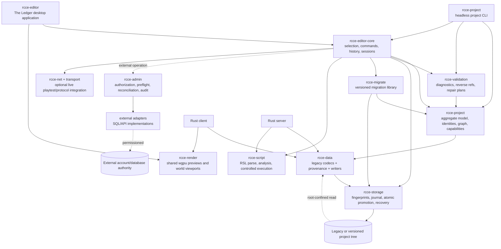

# Rust super editor and engine migration

## Status

- **Stage**: `Plan`
- **Program outcome**: one Rust-native RCCE toolchain—editor, client, server, project utilities, and build/publish pipeline—that can open and operate existing RCCE projects without BlitzForge or project-owned C/C++ application code
- **Initial product**: the Rust super editor represented by the accepted “The Ledger” proof of concept
- **Last updated**: `2026-07-20`
- **Evidence snapshot**: repository checkout and supplied standalone PoC inspected on `2026-07-20`

## Goal (player outcome)

An RCCE creator can open an existing project, understand its complete state, author every supported content domain, preview and validate the result, run it with the Rust client/server, and publish it without launching a legacy editor or installing BlitzForge. Existing project identities, numeric IDs, file-based relationships, media, zones, scripts, and specialist source documents remain usable. If a future capability requires a new project format, the toolchain performs an explicit, reversible, verified conversion rather than silently stranding the old project.

This program uses a **living bridge** as its organizing model:

1. Existing project files are the stable bank from which development starts.
2. Shared Rust codecs, project services, rendering, scripting, and networking form the bridge.
3. Editor capability families cross that bridge incrementally, with compatibility evidence at every span.
4. Blitz applications are retired only after their state mutations and user outcomes have crossed.
5. A new project format, if introduced, is another supported bank—not a reason to burn the bridge behind existing projects.

The thesis is: **RCCE becomes a Rust platform by centralizing project truth and proving compatibility, not by reproducing the old windows one-for-one.**

## Acceptance criteria (what “done” means)

### Super editor product

- A user can discover, create, open, clone, rename, validate, repair, back up, migrate, and publish an RCCE project from the Rust application.
- The editor covers the full capability families recorded in [`editor-suite-master-spec.md`](../../editor-suite-master-spec.md): project shell, canonical records, relationships, world authoring, terrain, reusable mesh construction, attachment calibration, media, scripts, UI assets, administrative state, and downstream publication.
- “The Ledger” state model is real: every mutation is visibly classified as pending, committed to project files, applied immediately, or external; its affected resources and recovery semantics are inspectable.
- Entity relationships are navigable in both directions when derivable. Broken references are computed from current working state, not a static issue list.
- Renames, deletes, ID reuse, imports, paired-zone changes, and publication show their dependency impact before destructive or externally shared effects occur.
- Undo/redo covers in-memory editor commands. Disk recovery covers failed multi-file operations. External operations expose compensation when true rollback is impossible.
- The UI is keyboard-operable, exposes accessible names and focus, and remains usable at the explicitly supported desktop viewport.

### Existing-project compatibility

- An unchanged legacy project can be opened directly; conversion is not required merely to inspect or perform supported legacy-safe edits.
- For each supported legacy document, an unchanged read/write round trip is byte-identical unless the format contract explicitly permits canonical normalization.
- Sparse numeric slots, sentinels, filename-derived identity, unknown/pass-through bytes, missing references, and partial paired zones are preserved or diagnosed—never silently renumbered, repaired, or discarded.
- The Rust client and Rust server consume the same project-format crates and semantic models used by the editor where their responsibilities overlap.
- A versioned compatibility matrix identifies every known file family as `inventory-only`, `read`, `lossless-round-trip`, `semantic-write`, `converted`, or `unsupported-with-reason`.

### Format evolution and conversion

- No new format is introduced without a demonstrated requirement that cannot be met safely in the current format.
- Every new format is versioned and documented with a legacy-to-new mapping, downgrade boundary, and minimum compatible client/server/editor versions.
- Conversion defaults to a new destination or verified backup; it supports dry-run, produces checksums and a machine-readable report, validates the result, and is idempotent.
- A conversion failure leaves the source project unchanged and identifies the exact file, field, and recovery action.
- During any transition period, the supported Rust applications either read both formats or fail with an actionable compatibility message before mutation.

### All-Rust engine cutover

- Rust editor, client, and server meet their separate parity scorecards against representative legacy projects and interoperate using shared Rust crates.
- Publishing produces packages containing the Rust client/server and no BlitzForge-built executable.
- Production build, test, packaging, and runtime paths require no BlitzForge compiler/runtime, project-owned C/C++ engine/editor application, or legacy editor executable. Operating-system APIs, graphics drivers, and platform SDK components are not classified as RCCE application code.
- The current vendored C ENet bridge is replaced by a Rust implementation before the final “Rust-only” gate. A server-side transport seam is introduced earlier so final cutover swaps a backend rather than restructures the authoritative loop.
- Each legacy application has a signed-off disposition: replaced, imported/converted, intentionally unsupported with an alternative, or retained only as an archival reference.
- Removal of legacy source/build dependencies is a separate, reversible repository change after parity, migration rehearsal, and user approval—not part of an early editor milestone.

## Non-goals (explicitly out of scope)

- Rewriting the Rust client or Rust server inside the editor project. This plan coordinates and shares foundations with their existing parity plans.
- Preserving known editor defects merely because they are observable in GUE, Loom, or a specialist tool.
- Duplicating every legacy window, tab, modal, workflow, or immediate-write quirk.
- Automatically converting a project on open.
- Hiding filesystem identity, numeric identity, or persistence consequences behind a purely visual abstraction.
- Treating external account/database administration as an ordinary undoable content edit.
- Claiming opaque binary-only utilities are replaced until their useful outcomes are recovered, redefined, or explicitly retired.
- Real-time multi-user collaborative editing in the initial program. File-change conflict detection and safe single-writer recovery are required.
- Changing gameplay protocol or content semantics solely to simplify the editor before the Rust client/server parity contracts permit it.

## Assumptions / constraints

- Existing projects and their current on-disk formats are first-class compatibility targets.
- Windows is the initial creator platform because the current suite and existing user workflows are Windows-oriented. Architecture and crate selection must remain cross-platform; Linux editor packaging follows once core authoring is stable.
- Rust `1.85` remains the declared minimum until the repository toolchain policy changes through its own reviewed decision.
- The current two Rust workspaces are already productive. Workspace consolidation is allowed only when it reduces duplication without blocking ongoing client/server parity work.
- `rcce-data`, `rcce-render`, `rcce-net`, `enet-sys`, `rcce-server-core`, and `rcce-script` are reusable foundations, but they are not assumed editor-ready. Most `rcce-data` paths currently parse rather than losslessly write; server-core contains overlapping Blitz stream and domain readers.
- The editor may add project-private metadata under a clearly namespaced directory ignored by legacy runtimes. Gameplay state must not depend on that metadata while legacy compatibility remains supported.
- Multi-file “atomicity” means journaled logical recovery over individually atomic file promotions; ordinary filesystems do not provide a universal cross-file transaction.
- Project data, external databases, and published output trees are separate persistence authorities and must remain visibly distinct.
- Every project read and write is confined through a validated project-root capability. Persisted project strings are never treated as trusted host paths.
- Retrieved legacy behavior is evidence, not a mandate. Security, durability, and data-loss bugs are corrected with migration notes rather than preserved by default.

## Links (source material)

- Product and state requirements: [`docs/editor-suite-master-spec.md`](../../editor-suite-master-spec.md)
- Accepted design direction: `RCCE Super Editor - Brief & PoC v2 (standalone).html` is an external handoff artifact and is not a durable repository dependency; its reviewed SHA-256 is `b1d40fe32763f49a2328cdd5611e7f0874ec18c475506efa64083827d1b66e7e`
- Loom product lineage: [`docs/loom/README.md`](../../loom/README.md), [`docs/loom/architecture.md`](../../loom/architecture.md), and [`docs/loom/roadmap.md`](../../loom/roadmap.md)
- Rust client parity plan: [`docs/rust-client/PLAN.md`](../../rust-client/PLAN.md)
- Rust server parity plan: [`docs/rust-server/PLAN.md`](../../rust-server/PLAN.md)
- Rust server durable state: [`docs/rust-server/STATE.md`](../../rust-server/STATE.md)
- Manual QA notes, created before the first interactive milestone: `docs/qa/rust-super-editor-engine-migration_qa.md`

## Research (current state)

### Existing Rust foundations

| Foundation | Inspected current capability | Editor reuse | Required evolution |
|---|---|---|---|
| `client-rs/crates/rcce-data` | Parses actors, items, spells, projectiles, animation sets, attributes, fixed attributes, damage, interface, money, options, suns, media catalogs, emitter configs, visual areas, textures, and B3D | Canonical legacy decoding, asset discovery, previews | Add strict/lossless modes, provenance, writers, unknown-tail preservation, and coverage for missing editor domains |
| `client-rs/crates/rcce-render` | `wgpu` rendering, scenes, models, skeletal data, world views, overlays, headless PNG evidence | Shared 2D/3D preview and world viewport backend | Separate reusable viewport APIs from client-game assumptions; add editor picking/gizmos/offscreen thumbnails |
| `client-rs/crates/rcce-net` | Shared wire codec, framing, authentication helpers | Playtest/session integration and protocol fixtures | Keep editor-independent; use only where live preview or server administration actually needs network access |
| `client-rs/crates/enet-sys` | RCCE ENet fork through native FFI | Transitional compatibility only | Replace or fence behind a transport trait; remove from final Rust-only gate |
| `server-rs/crates/rcce-server-core` | Gameplay area, actor catalog, factions, environment, character/account serializers, Blitz stream reader/writer | Gameplay-zone semantics and existing write primitives | Eliminate duplicated project-format interpretations by moving shared definitions into one format/project layer |
| `server-rs/crates/rcce-script` | Rust RSL lexer, parser, interpreter, built-ins, real-script tests | Script editing, syntax/semantic diagnostics, symbol/reference index, preview sandbox | Expose analysis APIs that do not require running an authoritative server; preserve privilege boundaries |
| `server-rs/crates/rcce-server` | Headless authoritative runtime using shared data/network crates | Embedded/local playtest process, validation against server semantics | Keep process-isolated; editor must not link authoritative mutable runtime state into its UI process |

### Existing project-state constraints

- The suite owns 19 in-scope or adjacent applications and twelve capability families; replacing only GUE and Loom is not suite retirement.
- Canonical collections are sparse, fixed-capacity structures. Empty numeric slots and sentinel values are part of project identity.
- Media identity is split across numeric registry slot, stored relative path, and physical file.
- A zone is a coordinated set of visual area, gameplay area, and sometimes specialist terrain source—not one atomic legacy document.
- Project relationships use numeric IDs, filenames/basenames, display names, and session-only handles. Only persisted identities belong in the cross-application model.
- Current safe writes generally protect one file. Settings, environment, paired zones, publication, and external administration cross multiple persistence authorities.
- Specialist tools often preserve editable source that is lost in exported runtime assets; import/export alone is not authoring parity.
- Current Rust readers are deliberately tolerant in several places, retaining parsed prefixes on malformed tails. The editor needs a distinct diagnostic/lossless mode so tolerant runtime loading does not silently authorize destructive rewrites.

### Evidence classification for implementation

- **Confirmed by inspected Rust source**: existing crate boundaries and parser/render/server/script foundations above.
- **Confirmed by inspected legacy source/artifacts**: state families, capacities, mutation surfaces, specialist source formats, and persistence boundaries in the master specification.
- **Observed in the supplied PoC**: unified lenses, Ledger mutation lanes, partial-write recovery, conflict choices, integrity-aware rename, preflight, reset, and desktop/keyboard boundaries.
- **Still unknown**: SkinCrafter’s useful contract; exact Spell Wizard overwrite path; complete binary-tool encoding/backup behavior; third-party project conventions outside the available corpus.

## Analysis

### Options considered

1. **Rebuild each editor as a separate Rust application.** This minimizes conceptual change, but perpetuates independent snapshots, duplicate save logic, inconsistent validation, launcher fragmentation, and cross-tool conflicts. It fails the super-editor goal.
2. **Introduce a new project format first, then build the editor on it.** This simplifies a greenfield data model, but makes conversion the first critical path, delays useful editing, and risks losing legacy semantics before writers are proven.
3. **Build one compatibility-first Rust project platform and super editor, then evolve storage behind versioned adapters.** Existing formats remain authoritative initially; readers/writers, validation, transactions, rendering, and commands become shared crates. New formats are introduced only behind proven converters.

### Decision

- **Chosen**: option 3, a compatibility-first project platform with a single Rust editor application and explicit migration adapters.
- **Why**: it delivers user value early, maximizes reuse from the Rust client/server, makes compatibility measurable, and creates the shared state boundary required to retire the legacy suite safely.

### Target logical architecture



The diagram is logical, not a demand for an immediate directory reshuffle. Existing productive workspace paths remain until a separately verified workspace-convergence change can move them without interrupting client/server work.

The initial physical layout is deliberately additive:

```text
editor-rs/
├── Cargo.toml
└── crates/
    ├── rcce-editor/          # desktop binary and composition root
    ├── rcce-editor-core/     # commands, sessions, history, selection
    ├── rcce-project/         # discovery, aggregate model, identities
    ├── rcce-validation/      # reference graph and diagnostics
    ├── rcce-storage/         # fingerprints, commit plans, journal/recovery
    ├── rcce-migrate/         # versioned migration library
    ├── rcce-admin/           # headless external-operation service and ports
    └── rcce-project-cli/     # `rcce-project` executable composition root
```

These crates consume existing packages by path. A crate moves to a shared root only when at least two applications consume it and the relocation has an isolated build/test migration. UI framework dependencies are permitted only in `rcce-editor`; every other listed crate remains headless. The installed `rcce-project` CLI is the only project/migration command-line composition root; `rcce-migrate` is a library, not a competing binary.

### Core architectural decisions

#### 1. One project model, many lenses

- `ProjectSnapshot` represents one opened filesystem snapshot and its source fingerprints.
- `ProjectModel` exposes stable domain identities without erasing legacy representation: numeric slot IDs remain numeric, zone names retain filename provenance, and media retains catalog/file duality.
- `RawLegacyString` retains exact bytes plus a non-authoritative display decoding. Filesystem targets, reference identity, and serializers use validated raw/canonical representations—never replacement-character display text. Each field declares its permitted bytes/encoding; an edit that cannot be represented is rejected or requires an explicit format conversion.
- Text documents retain BOM, line-ending, trailing-newline, and unrelated raw-line conventions on a bounded edit.
- Unchanged floats retain their original bit patterns, including signed zero and non-canonical values; edited values pass domain validation before serialization.
- Offset-table formats retain raw index cells, record spans, alias groups, out-of-order records, gaps, unreachable/orphan records, and malformed-but-occupied slots. A semantic edit patches only its declared index/record bytes or appends a new record and updates one index; whole-file canonicalization is a named conversion, never an ordinary save.
- Lenses query the same model. Switching Records/World/Assets/Scripts/Vault changes presentation and tools, not the underlying object identity or persistence authority.
- Session-only UI handles never enter project serializers or cross-process references.

#### 2. Commands are the only editor mutation path

Every edit is a typed `ProjectCommand` with:

- intent and user-visible description;
- target identity and precondition fingerprints;
- affected model objects and expected files;
- persistence class: `PendingProject`, `ImmediateProject`, `External`, or `Projection`;
- validation delta and inbound-reference consequences;
- reversible in-memory inverse when possible;
- disk recovery or external compensation description;
- authorization requirement;
- audit result.

Direct file writes from UI widgets are forbidden. Imports, generators, rename/delete, Settings, paired-zone edits, publication, and database actions all enter through this boundary even when their persistence class differs.

External effects use a headless `ExternalOperation` application service. It owns authorization, preflight, idempotency/transaction policy, secret redaction, adapter execution, read-back reconciliation, audit, and compensation metadata. Outcomes are `Succeeded`, `FailedBeforeApply`, or `OutcomeUnknown`; an unknown outcome is never blindly replayed or presented as a clean failure.

#### 3. Lossless legacy documents precede semantic writers

Each format adapter supports an explicit compatibility ladder:

| Level | Meaning | Authoring permitted |
|---|---|---|
| `I0 Inventory` | File is discovered and classified; bytes remain opaque | No |
| `I1 Read` | Known fields can be parsed for display/runtime use | No |
| `I2 Lossless` | Unchanged parse/write is byte-identical, including unknown/pass-through data | Only no-op proof |
| `I3 Semantic write` | Supported field mutations preserve all unrelated data and invariants | Yes, bounded fields |
| `I4 Convert` | Versioned upgrade/downgrade mapping is tested | Yes in declared direction |

Runtime-tolerant parsing and editor-authoritative parsing are separate modes. A truncated file that is acceptable for soft-fail runtime loading may open read-only with diagnostics in the editor until an explicit repair is chosen.

M1 does not call an I1/tolerant view authoritative. Counts and diagnostics are labeled provisional unless that domain has a minimal raw/provenance envelope, explicit sentinel semantics, and client/server/editor consensus fixtures. Repair controls remain disabled until the affected format reaches the required I2/I3 level.

#### 4. Persistence is journaled, not overclaimed

- Format adapters produce validated opaque byte artifacts and optional reparse callbacks; `rcce-storage` knows paths, bytes, fingerprints, checksums, and durable states but does not depend on `rcce-data` or domain types.
- A commit plan enumerates all files, original fingerprints, retained original bytes/recovery copies, same-volume temporary outputs, final checksums, and promotion order before writing.
- The journal ADR defines a persisted state machine and ordering for journal flush, temporary-file flush, precondition recheck immediately before each handle-based replacement, replacement, parent-directory durability, and completion. Platform-specific metadata/ACL behavior is explicit.
- A project-local recovery journal records the logical action and each durable promotion state. On interruption, reopen classifies original/new/temp/external fingerprints before offering retry, compensation, preserve-copy, or inspection. Compensation is offered only while the current fingerprint still matches the action’s written output.
- Cross-file actions are described as logically grouped and recoverable, never universally atomic.
- External database actions never enter the filesystem journal as though rollback were guaranteed; their audit record links to an explicit compensation action.
- Credentials and authentication tokens are never serialized into project history, recovery journals, migration reports, diagnostic bundles, or command descriptions.

#### 5. Conflict detection is optimistic and visible

- Files are fingerprinted at load and after successful commit.
- Before every individual promotion—not only once per plan—changed fingerprints block affected commands. Open handles/root capabilities prevent a checked path from being silently re-resolved to another target.
- Structured three-way merge may be offered only for domains with stable field identity; otherwise the choices are reload, preserve a copy, deliberate overwrite, or defer.
- An advisory project lock may reduce accidental concurrent legacy-editor use, but it does not replace fingerprint checks.

#### 6. Rendering is shared; application state is not

- `rcce-render` remains the wgpu implementation used by the client and editor.
- Editor viewport APIs accept declarative scene/project data and return picking/preview results without importing client session globals.
- World editing adds editor-specific selection IDs, gizmos, collision/picking, offscreen thumbnails, and deterministic screenshot fixtures behind reusable renderer traits.
- The editor launches the Rust server/client as child processes for playtest. It does not embed authoritative server mutation into the UI thread.
- The compositing contract uses one `wgpu` instance/adapter/device/queue for editor UI and live viewports. The spike must choose caller-owned encoder recording or returned viewport textures, and prove deterministic ordering, two simultaneous viewports, picking readback, resizing/high DPI, device-loss recovery, and unchanged client screenshot behavior.

#### 7. UI technology is validated by a bounded spike

- Recommended initial stack: `winit` + `wgpu` reuse with `egui`/`egui-wgpu` for desktop tooling, styled to the accepted design rather than default widgets.
- The choice becomes locked only after a spike proves docking/panels, large virtualized catalogs, keyboard/focus/accessibility, high-DPI text, native file dialogs, and embedding an `rcce-render` viewport.
- If the spike fails a gate, compare `iced` and `Slint` against the same executable harness. Product architecture must not depend on framework-specific widget state.

Before production UI work, M0 defines small/default/large reference fixtures, records reference hardware, and approves explicit budgets. Initial gates are: visible progress within 250 ms during project open; default project ready within 5 s; lens/focus feedback within 100 ms p95; incremental diagnostics within 250 ms p95; cancellation acknowledged within 250 ms; and an interactive world viewport sustaining 60 fps p95 on the reference fixture/hardware. M0 sets measured memory and commit-duration budgets for all three fixture sizes before M1 exits. If baselines show a gate is unrealistic, the ADR changes the number with evidence rather than silently waiving it.

The initial accessibility contract is Windows keyboard-only completion of every M1 flow, visible focus, Windows UI Automation semantics sufficient for Narrator to announce controls/state/errors, WCAG 2.2 AA text/essential-control contrast, 200% scaling, reduced-motion respect, and usable layout at desktop width 1024 px. Later platform support names equivalent assistive-technology gates before release.

#### 8. Workspace convergence follows reuse, not the reverse

- The editor initially path-depends on existing Rust crates; it does not copy them.
- Shared project-format definitions move toward one physical crate only when duplicate Rust interpretations have contract tests proving equivalence.
- A future root workspace or shared `rust/` workspace is desirable for unified lockfile/lints/builds, but it is a milestone with explicit compatibility checks—not prerequisite churn for the first editor window.
- Shared-crate changes remain additive until each consumer migrates explicitly. Any change to `rcce-data`, `rcce-render`, `rcce-net`, or another reused crate fans CI out across client, server, and editor build/test/Clippy matrices, with downstream API fixtures and semantic golden tests.

#### 9. Project-root confinement is a security boundary

- Every filesystem action starts from a canonical, opened project-root capability and resolves a typed project-relative path beneath it.
- Absolute, drive-relative, UNC/device, reserved-name, traversal, alternate-data-stream, normalized/case-colliding, and embedded-separator targets are rejected unless an operation explicitly owns a separately selected destination root.
- Project scanning, clone, backup, migration, publication, import, rename, delete, and recovery do not follow symlinks, junctions, reparse points, or mount links by default. Hardlinked mutation targets are refused or broken into private copies under a documented policy.
- Validation and previews do not read linked content outside the root. Promotion operates on the already validated root-confined handle and detects link/path swaps rather than re-resolving untrusted strings.
- Destination roots for clone/migrate/publish are separate capabilities with the same confinement rules; a source and destination resolving to the same file identity are rejected.

#### 10. Specialist plugins are capability-confined artifact producers

- Versioned/untrusted plugins run out of process from a declared capability manifest. Project filesystem, secret/dynamic state, network, database, process spawn, and arbitrary host paths are denied by default.
- The host supplies selected input bytes or bounded read-only handles plus isolated scratch/output capabilities; it never gives a plugin a writable canonical project path.
- Returned output is untrusted staged data. Size/type limits, root/state classification, format reparse/validation, command preflight, and `rcce-storage` promotion all occur in the host before it can become project state.
- Crashes, hangs, malformed output, or denied-capability attempts terminate/quarantine the plugin operation without mutating the project. Any trusted in-process extension tier is separately disclosed and cannot claim this containment guarantee.

#### 11. Editor metadata has explicit ownership and versioning

- The metadata/journal namespace begins with an ownership marker containing schema version, tool version, and project identity. It is atomically reserved only when the target path is absent under the root capability.
- A pre-existing ordinary-file collision, unowned/nonempty directory, link/reparse point, malformed marker, copied-project identity mismatch, or newer schema is inventory-only and blocks metadata writes until the user explicitly relocates or adopts it.
- Versioned metadata upgrades preserve unknown keys and retain a verified backup. Runtimes ignore the namespace; clone/backup/migrate/publish include or exclude it only through their declared output allowlists.

### Format strategy

#### Legacy-first operating mode

- Legacy projects open in place after read-only inventory and validation.
- I3 domains can be edited and written in their current format.
- I0/I1 domains remain visible but read-only with a reason and linked compatibility work item.
- New editor metadata lives under `Data/.rcce/` or another ADR-approved namespace and must be ignorable by legacy and Rust runtimes. The final location is chosen after testing Windows hidden-directory and packaging behavior.

#### New-format trigger

A new format is justified only by a recorded requirement such as:

- legacy capacity or identity cannot represent a required feature;
- lossless editing cannot be made safe because the layout is inherently ambiguous;
- transactional grouping or lineage requires metadata that cannot live safely beside legacy documents;
- Rust client/server functionality needs a versioned semantic extension.

Convenience, aesthetic preference, or dislike of binary files is insufficient.

#### Conversion contract

The `rcce-project` CLI and editor use the same migration library:

```text
rcce-project inspect <root>
rcce-project validate <root> --format json
rcce-project migrate <source> --to <version> --output <destination> --dry-run
rcce-project migrate <source> --to <version> --output <destination>
rcce-project verify <destination> --against <report.json>
rcce-project rollback <destination> --journal <journal-id>
```

Every report contains source/destination versions, tool version, timestamps, file hashes, identity mappings, repairs/defaults, warnings, unsupported artifacts, and verification results. Conversion never silently resolves dangling references or compacts sparse IDs.

The source is immutable and fingerprint-pinned for the entire conversion. Destination must be empty and non-aliasing by default; replacing a non-empty destination requires an explicit, separately verified backup. The journal owns only paths it created, distinguishes resume from restart, and never removes post-conversion user changes during rollback. Byte idempotence is required where deterministic bytes are promised; otherwise semantic idempotence and intentionally variable metadata are enumerated. “Adopt converted project” is a separate action available only after verification succeeds.

### State classification and output allowlists

Every inventoried path is classified as `PublicClient`, `ServerConfig`, `Secret`, `DynamicPrivate`, `EditorMetadata`, `AuthoringSource`, or `Unknown`. Clone, backup, migration, diagnostic bundle, playtest snapshot, client publication, and server publication each use a documented allowlist:

- client packages hard-deny server configuration, secrets, and dynamic/private state;
- server credentials and dynamic data require separate explicit preflight choices;
- backups and migrations disclose secret inclusion, use restrictive permissions, and never echo secret values into manifests/logs;
- diagnostics exclude contents and names classified as secrets unless the user explicitly selects a redacted attachment;
- `Unknown` is excluded from outward projections by default and preserved in full project copies only with disclosure.

### Product behavior carried forward from the PoC

- The header establishes project identity, source snapshot, role, broken-reference count, pending count, history, publish, and reset/reload status.
- Records, World, Assets, Scripts, and permissioned administrative surfaces are lenses over one loaded project.
- Focus presents identity, editable properties, outbound references, inbound references, provenance, and persistence location.
- The Ledger distinguishes pending project writes, committed project history, immediate/applied state, external effects, and projections.
- Guided scenarios remain a development/QA mode, not required production chrome.
- The production application must demonstrate the PoC’s failure, recovery, conflict, rename, preflight, and reset semantics with real files and reversible fixtures.

### Risks / edge cases

| Risk | Consequence | Mitigation / proof |
|---|---|---|
| Tolerant parser drops an unknown tail | Opening and saving corrupts an old project | I2 gate, original-byte retention, mutation-local writers, golden third-party corpus |
| Rust client/server/editor hold divergent structures | One app accepts state another misreads | Shared crate ownership, cross-consumer contract tests, one compatibility matrix |
| Whole-workspace reorganization stalls parity | Editor work blocks active client/server development | Path-dependency reuse first; convergence as isolated milestone |
| Multi-file interruption | Paired zone/settings become mixed-version | Commit manifest, per-file hashes, recovery journal, injected-failure tests |
| Numeric ID compaction/reuse breaks references | Actors/items/media point to wrong objects | Sparse-slot types, allocation policy, reverse-ref preflight, no implicit renumbering |
| Zone rename misses name-based references | Portals/weather/scripts point to old name | Reference index plus previewable remap plan; preserve-broken and block alternatives |
| Imported file and catalog update diverge | Orphan file or dangling registry slot | One compound command, staged copy, deterministic ID allocation, compensation |
| Renderer becomes coupled to editor UI | Client and editor cannot reuse improvements | Scene/viewport traits, headless fixtures, dependency-direction checks |
| Script preview executes privileged behavior | Project authoring compromises host/server | Static analysis by default; sandboxed process for execution; explicit capability allowlist |
| External account tools appear undoable | Shared database state is changed unexpectedly | Separate role, authentication, preflight, audit, compensation-only wording |
| New format strands old binaries/projects | Split ecosystem | version negotiation, dual readers during transition, converter verification, downgrade statement |
| Opaque legacy tools hide necessary workflows | Premature retirement loses capability | user workflow interviews, artifact corpus, disposition ledger, import/plugin escape hatch |
| Large catalogs/areas exhaust UI responsiveness | Editor feels worse than specialist tools | background parsing, virtualized lists, incremental validation, cancellation, performance budgets |

### Open questions

These do not block Milestone 0; the plan supplies conservative defaults until evidence changes them.

1. **Which third-party legacy projects form the compatibility corpus?** Default: repository project plus opt-in sanitized projects; never upload or modify originals.
2. **Does external account administration ship inside the editor binary?** Default: same product shell but separately permissioned module/process, disabled unless configured and authenticated.
3. **When is a new project format actually needed?** Default: remain legacy-native through the first complete record/media/world authoring milestones; require an ADR with measured limitations before format v2 work begins.

## Pitch (product-complete spec)

### Creator story

The creator opens a project root. Before permitting writes, the Rust project platform inventories every recognized file, fingerprints it, loads lossless-capable domains, and reports compatibility level and diagnostics. The editor presents the project as one connected system rather than a launcher full of disconnected utilities.

The creator can move among records, world, assets, scripts, and administrative surfaces without losing focus context or creating independent snapshots. Selecting an object reveals its persisted identity and threads to other objects. Editing creates a command in the Ledger; the command says which files it will write and which references it affects. Broken state remains visible and navigable.

Before commit, the creator reviews the exact write plan. The storage layer checks that source files have not changed, serializes temporary outputs, validates them by reparsing, and promotes each file while journaling progress. A failure names what succeeded, what did not, and which recovery actions are truthful. History records the outcome rather than only the user’s intent.

The creator can generate or import media, terrain, meshes, emitters, scripts, and UI assets without leaving the project state model. Editable source lineage stays attached to derived runtime artifacts. The editor can launch Rust client/server playtests against a safe project snapshot. Publish assembles Rust runtime projections only after validation and preflight.

When a project needs a newer format, the same application previews a conversion report, writes a separate destination or backup, verifies it with the shared Rust readers, and records all identity mappings. The original remains usable until the creator deliberately adopts the converted copy.

### Rules and mechanics

- Opening is read-only until inventory, fingerprinting, and minimum compatibility checks complete.
- Unsupported files never prevent inventory of the rest of the project, but any affected logical action is blocked from destructive write.
- Diagnostics have stable codes, severity, source location, affected identity, and available repair commands.
- Validation updates incrementally after each command and fully before commit/publish.
- Reset means restore the in-memory model to the last loaded/committed snapshot; it does not claim to undo external state.
- Reload means inventory current disk state and explicitly resolve or discard pending commands.
- Publication consumes a committed snapshot. Pending edits are excluded unless the creator commits them first.
- Playtest defaults to a disposable snapshot so runtime save/account activity cannot pollute authoring data.
- Every generated runtime artifact records lineage to its editable source when such source exists.
- Every capability exposes whether it is production-ready, experimental, read-only, or unavailable for the opened project’s compatibility level.

### Product surfaces

The design remains free to evolve, but the product must provide these outcomes:

- project open/create/recent/clone/backup/migrate/publish;
- project compatibility and health overview;
- unified find/focus/thread navigation;
- canonical record authoring and preview;
- visual/gameplay world authoring with paired-state awareness;
- media registry and physical-file lifecycle;
- terrain and reusable mesh authoring with source lineage;
- RSL editing, search, references, diagnostics, and controlled testing;
- interface/font/asset preview and authoring;
- Ledger history, write plans, recovery, and conflict resolution;
- separately permissioned external administration;
- Rust client/server playtest and Rust-only package assembly.

### Capability disposition ledger

Every application row in the master specification receives one disposition and evidence link:

| Legacy application/family | Target disposition |
|---|---|
| Project Manager | Native project shell, migration, playtest, and publish workflows |
| GUE | Native canonical records, media, complete visual/gameplay world and settings authoring |
| Loom | Native relationship intelligence, validation, history, search, focus, and atlas concepts |
| Terrain Editor | Native layered terrain pipeline plus importer for `.rct`/`.mbr` where recoverable |
| Architect/Caves/Rock/Tree | Native or plugin-backed procedural mesh authoring; source import retained |
| Gubbin Tool | Native attachment calibration and safe B3D transform pipeline |
| Script tools | Native RSL workspace using `rcce-script`, plus template/import support |
| Font/audio/vegetation generators | Native generation where justified; otherwise first-class import/conversion pipeline |
| MySQL Configure | Separately permissioned configuration/admin module with external audit semantics |
| SkinCrafter/opaque utilities | Evidence-gathering gate before replace/retire disposition |

### Telemetry and diagnostics

- Default telemetry is local and project-scoped: load duration, file counts, validation duration, commit duration, recovery events, renderer frame timing, and conversion outcomes.
- No project content, filenames, credentials, account data, or scripts leave the machine without an explicit future opt-in policy.
- Diagnostic bundles redact secrets and can include version, platform, compatibility matrix, journal metadata, and user-selected logs.

## Plan (implementation-ready)

### Milestones

Milestones are program gates. Work inside them is issued as a **capability packet** keyed to the format and capability matrices. Every packet names an owner, prerequisite compatibility level, exact paths/crates, fixture set, RED proof, implementation boundary, client/server consumers, verification commands, and evidence that advances matrix rows. Broad labels such as “all canonical domains” or “all specialist tools” are portfolios of packets, not single implementation tasks.

The Rust client and server parity scorecards are external dependencies, not assumed background progress. Each milestone records the exact client/server features and shared-crate versions it requires; unmet dependencies block the dependent editor gate. M9 publication and M10 retirement cannot pass while either named parity plan remains below its required scorecard.

#### M0 — Program baseline and compatibility laboratory

Produce the durable matrices and automated corpus harness that prevent the migration from relying on memory or UI impressions.

**Exit gate**: every known state family and legacy application has an owner, compatibility level, fixture/evidence status, and retirement criterion; existing Rust workspaces have recorded green baselines or explicitly recorded pre-existing failures.

#### M1 — Rust project platform, read-only editor shell

Open an existing project through `rcce-project`, show project identity, inventories, compatibility levels, records/world/assets/scripts lenses, real diagnostics, and shared `rcce-render` previews. No project mutation is enabled.

**Exit gate**: repository project and compatibility fixtures open without writes; all rendered counts and broken references derive from the loaded model; headless and interactive smoke evidence exists.

#### M2 — Lossless codecs and durable command/storage core

Add writer/provenance support domain by domain, typed commands, undo/redo, write plans, fingerprints, journals, injected failure, recovery, history, and the safe project-shell mutations (create from template, recent roots, rename, clone, backup).

**Exit gate**: selected I3 domains prove byte-identical no-op round trips, mutation-local diffs, conflict blocking, crash recovery, and reset semantics; project-shell operations obey confinement, secret classification, and source-preservation gates.

#### M3 — Canonical records and relationship intelligence

Actors, Items, Spells, Projectiles, Factions, Animation Sets, Attributes, Damage, Environment, Suns, Interface, particle/emitter records, and settings become authorable with reverse references and integrity-aware rename/delete/copy.

**Exit gate**: capability matrix reaches semantic-write for all canonical collections and global settings; Rust client/server load edited fixtures successfully.

#### M4 — Media lifecycle and preview parity

Unify physical import, registry allocation, preview/audition, scale/offset, orphan handling, deletion, and source lineage.

**Exit gate**: imported and removed media cannot leave the model/diagnostics stale; actor/item/spell/projectile/world previews resolve through the same catalog semantics as the Rust client.

#### M5 — Complete paired-world authoring

Deliver gameplay markers/policies, scenery, terrain, water, emitters, volumes, sound zones, lighting, navigation, paired lifecycle, zone rename/copy/delete, and world validation.

**Exit gate**: representative legacy zones round-trip, edited zones render in Rust client, simulate partial paired writes, recover, and preserve unsupported pass-through sections.

#### M6 — Specialist authoring absorption

Bring terrain source, architecture/caves/rocks/trees, gubbin calibration, vegetation, fonts, audio conversion, and source-to-runtime lineage into native modules or versioned plugins/importers.

**Exit gate**: every source-built specialist tool has feature-by-feature disposition evidence; generated outputs load in the Rust client and remain re-editable where the legacy source format allowed it.

#### M7 — Script workspace and controlled playtest

Use `rcce-script` for RSL syntax, symbols, command validation, reverse references, templates, and sandboxed tests. Introduce the server host-transport seam, then launch isolated Rust server/client sessions from committed or disposable snapshots.

**Exit gate**: shipped scripts and representative generated scripts analyze correctly; privileged actions cannot execute from editor analysis; playtest does not mutate the authoring project unless explicitly promoted.

#### M8 — Permissioned external administration

Deliver MySQL configuration and account operations through `rcce-admin`, with credential handling, authorization, preflight, transactions/idempotency where possible, outcome reconciliation, compensation verification, and redacted audit.

**Exit gate**: configuration and representative account operations pass authorized, unauthorized, timeout-after-apply, duplicate retry, concurrent administrator, read-back reconciliation, secret-canary, and audit-redaction tests. Unknown legacy/binary behavior remains unavailable rather than guessed.

#### M9 — Conditional project conversion and Rust publication

Ship inspect/validate/verify CLI flows and Rust client/server package assembly. Migration/version negotiation is implemented only when an accepted new-format ADR exists; otherwise this milestone proves legacy-native clone, backup, and verification without inventing a conversion target.

**Exit gate**: if a new-format ADR exists, rehearsed conversion is idempotent under its declared byte/semantic definition and source-preserving; otherwise legacy-native clone/backup/verification passes and migration remains unavailable. In either branch, published packages contain Rust runtime apps, satisfy named client/server scorecards, pass secret/dynamic-state scans, and run on a clean machine.

#### M10 — Legacy suite retirement and Rust-only gate

Close every disposition row, replace remaining native dependencies, update documentation/installers, and remove legacy build requirements only after approval.

**Exit gate**: no required build/test/package/runtime path invokes BlitzForge, Blitz runtime, project-owned C/C++ application code, legacy editors, or native ENet. Representative legacy projects pass editor/client/server workflows from a clean checkout; converted projects join that gate only when a new-format ADR exists.

### Task breakdown

#### M0 tasks

1. Create `docs/compat/project-format-matrix.md`, one row per file family with identity, raw encoding, parser/writer owners, compatibility level, topology, state classification, fixtures, consumers, and ambiguity.
2. Create `docs/compat/editor-capability-matrix.md`, mapping all 19 applications and twelve capability families to replacement packets, milestones, and retirement evidence.
3. Record exact Rust baselines for `client-rs` and `server-rs`: tests, Clippy, builds, parity scorecard revision, current failures, platform limits, and toolchain command.
4. Establish `test-data/projects/` policy and small/default/large manifests. Fixtures are copied/sanitized snapshots; tests never mutate the source corpus.
5. Add a read-only corpus scanner that hashes, classifies, and inventories project files without following links or parsing/writing contents.
6. Write ADRs for compatibility ladder, raw strings, root confinement/link policy, command-only mutations, durable journal, UI/render spike, owned/versioned metadata namespace, plugin capability model, and workspace convergence.
7. Create the state-classification/output-allowlist matrix and seed secret/dynamic-state canaries for projection tests.
8. Record milestone-level client/server parity dependencies and owners; a missing dependency is an explicit blocked gate, not an assumption.

#### M1 tasks

9. Add the full additive `editor-rs/` workspace skeleton from the physical-layout section; verify paths are tracked and do not collide with ignore rules.
10. Implement the capability-based project-root resolver and hostile path/link fixture suite before any domain loader consumes persisted paths.
11. Make `rcce-project` path-depend on existing `rcce-data`; implement root discovery, case-aware legacy resolution, identity, inventory, fingerprints, state classification, and compatibility status.
12. Introduce stable identity types (`ActorId`, `ItemId`, `MediaId`, `ZoneName`, `EmitterName`, `ScriptPath`) that retain legacy representation and reject cross-domain integer use.
13. Implement `RawLegacyString` and a minimal `LegacyDocument` envelope for only the domains used by M1 diagnostics.
14. Add sentinel, malformed, non-UTF8, and client/server/editor semantic-consensus fixtures for each M1 diagnostic domain; otherwise expose the data as provisional I1.
15. Implement `ProjectSnapshot` and read-only aggregate loading with cancellable jobs and deterministic progress events.
16. Complete the UI/render technology spike: one device/queue, two live viewport textures, overlays, picking, resize/high DPI, device loss, keyboard/focus/accessibility, and client-render regression proof.
17. Record the UI decision, then build the production shell and five lenses using real project queries; provisional state is visibly labeled.
18. Implement the first reference index and dynamic diagnostic only for consensus-proven domains; keep repair disabled.
19. Add headless screenshots and accessibility smoke checks for project open, lens switch, focus, diagnostic navigation, and the explicit minimum viewport.

#### M2 tasks

20. Add a shared raw `BlitzReader`/`BlitzWriter` contract and reconcile overlapping client/server primitives through golden tests before moving ownership.
21. Generalize `LegacyDocument<T>` provenance to original bytes, parsed spans, unknown sections, topology, source fingerprint, diagnostics, and compatibility level.
22. Model indexed-catalog cells, spans, aliases, gaps, orphans, invalid occupied slots, and append/patch mutation strategies before any media writer.
23. Implement I2 no-op writers for the smallest bounded formats first; media catalogs qualify only after task 22’s topology gates.
24. Implement `ProjectCommand`, preconditions, inverse operations, grouping, and deterministic replay in `rcce-editor-core`.
25. Keep `rcce-storage` format-agnostic; accept opaque validated artifacts and optional reparse callbacks without a dependency on `rcce-data`.
26. Implement same-volume temporaries, retained originals, durable journal transitions, per-file rechecks, handle-based promotion, parent-directory durability, and platform metadata policy.
27. Add real subprocess termination and failure injection at every durable boundary; prove reopen classification, retry, compensation, preserve-copy, and accurate audit outcomes.
28. Implement conflict checks and one structured merge spike; never compensate or overwrite across an unexpected current fingerprint.
29. Connect the Ledger to command/storage events so diagnostics reflect pending, committed, reset, reload, partial, and recovered states.
30. Implement project creation from a versioned template manifest without overwriting a non-empty destination.
31. Implement recent-project persistence, invalid-root handling, open/switch behavior, and convenience project/log-folder actions through canonical root capabilities.
32. Implement project rename, clone, and backup with source immutability, state-classification disclosure, output allowlists, and secret permissions.
33. Add headless project-shell integration tests covering collisions, aliases, links, disk-full, interruption, and source hash preservation.

#### M3 tasks

34. Issue one capability packet per canonical domain; each starts with RED writer fixtures and proves unrelated raw bytes remain stable.
35. Move duplicate actor/faction/environment/project-format structures toward one shared owner only after all consumer contract tests pass.
36. Implement sparse-slot allocation/reuse with explicit sentinel handling and no implicit compaction.
37. Implement create/copy/edit/delete commands with inbound-reference preflight for each proven domain.
38. Implement emitter/script filename rename plans with remap, preserve-broken, and block outcomes; zone rename waits for M5.
39. Expand `rcce-validation` by matrix row and emit stable diagnostic codes with source spans.
40. Add client/server consumer tests that load editor-written fixtures and compare declared semantic views.
41. Implement settings as grouped write plans across actual files; inject failures into every affected family.
42. Fan every shared-crate change through client, server, and editor build/test/Clippy CI plus downstream API fixtures.
43. Close M3 only from the sum of accepted capability packets; no “all domains” mega-change is permitted.

#### M4 tasks

44. Model media records, raw topology, physical files, hashes, flags, scale/offset, source lineage, and references as distinct connected identities.
45. Implement root-confined import as staged copy plus registry allocation; reparse and preview before promotion.
46. Implement remove-record, delete-file, replace-file, relink, and orphan adoption with accurate diagnostics and hardlink/link safety.
47. Reuse texture/B3D decoding and renderer previews; extract a reusable sound/music audition boundary from client code.
48. Add batch import and deterministic collision policy without renumbering existing IDs or canonicalizing unrelated topology.
49. Prove the missing-media regression: repair immediately changes diagnostics, commit preserves it, and reset restores the fixture.

#### M5 tasks

50. Specify complete visual/gameplay area schemas, pass-through sections, and partial/malformed variants.
51. Add I2 then I3 writers for gameplay and visual areas independently before grouped zone commands.
52. Reuse world rendering for terrain, scenery, water, lighting, emitters, actors/spawns, portals, waypoints, triggers, sound zones, collision, and picking.
53. Add editor gizmos and keyboard transforms that keep semantic coordinates independent from display decoration.
54. Implement paired-zone create/open/save/copy/delete with explicit affected files and missing-half behavior.
55. Implement zone rename only after both writers and the complete zone-reference matrix pass; offer remap, preserve-broken, and block.
56. Add portal graph/atlas and world diagnostics from the same reference index.
57. Kill/fail at every paired promotion boundary and verify recovery without overclaiming rollback.
58. Load edited zones in Rust client and gameplay semantics in Rust server; record screenshots and semantic assertions.
59. Close world parity through separate capability packets for each visual/gameplay subsystem.

#### M6 tasks

60. Classify every specialist source format’s import/edit/export fidelity and opaque sections in separate packets.
61. Implement the out-of-process plugin capability manifest/host and malicious-plugin harness before choosing native module versus plugin for any generator.
62. Extract reusable mesh construction/export primitives into headless Rust domain crates rather than UI callbacks.
63. Implement terrain sculpt/paint/hole/light/vegetation source plus deterministic runtime export and zone linkage.
64. Implement architecture, cave, rock, and tree packets independently as native modules or isolated plugins.
65. Implement attachment calibration with skeleton context, metadata edits, safe B3D transform output, and preview.
66. Add font atlas, image, and audio pipelines where known; retain first-class external import recipes where generation is unjustified.
67. Resolve SkinCrafter and opaque-tool dispositions through user workflow evidence before retirement.

#### M7 tasks

68. Expose `rcce-script` token, AST, symbol, call, and diagnostic APIs without server runtime coupling.
69. Implement script search, definitions/references, BVM documentation, diagnostics, and templates.
70. Add a process-isolated script harness with filesystem/network/database capabilities denied by default.
71. Introduce a server-side host transport contract while retaining ENet as its first backend; run fake/native interoperability suites.
72. Implement disposable playtest snapshots and child-process lifecycle only after named client/server parity dependencies pass.
73. Add logs/screenshot hooks and secret-safe diagnostic capture for playtest processes.
74. Require explicit promotion for selected runtime-generated content; never merge account/save mutations implicitly.

#### M8 tasks

75. Implement I2/I3 `MySQL.dat` configuration through `rcce-admin`: preserve legacy compatibility and unrelated bytes, mask plaintext credentials, use restrictive permissions/backups, and never place secrets in command history or journals. A secure credential-store migration requires a runtime-compatible ADR.
76. Implement account list/create/delete, password reset/change, DM status, and ban/unban as separate permissioned `ExternalOperation` packets, each declaring transaction and idempotency capability.
77. Model `Succeeded`, `FailedBeforeApply`, and `OutcomeUnknown`; reconcile unknown outcomes by read-back before retry/compensation.
78. Add unauthorized, timeout-after-apply, disconnect-mid-operation, duplicate retry, and concurrent-admin fixtures against fake adapters.
79. Add opt-in live integration tests that verify current DB state before compensation and redact all audits/reports.
80. Keep source-absent/unknown database behavior disabled and documented rather than inferred.

#### M9 tasks

81. Implement the `rcce-project` CLI composition root and JSON schemas for inspect, validate, verify, backup, clone, and conditional migration.
82. If no new-format ADR exists, prove legacy-native clone/backup/verification and mark migration commands unavailable with an explanation.
83. If an ADR exists, add its version manifest, immutable-source conversion steps, empty/non-alias destination, resume/restart, ownership journal, separate adoption, and dual readers.
84. Test same-file aliases, non-empty/cross-volume destinations, disk-full/kill, rerun, user edits, rollback, and adoption.
85. Replace publication with manifest-driven Rust package assembly, snapshot selection, backup, output allowlists, and secret/dynamic-state preflight.
86. Require named Rust client/server scorecards before publication can pass; a buildable binary alone is insufficient.
87. Scan client/server packages and archives recursively with secret/dynamic canaries and run clean-machine smoke tests.
88. Rehearse applicable conversions or legacy-native verification across every consented corpus project.

#### M10 tasks

89. Audit build scripts, CI, installers, docs, submodules, DLL/native libraries, and package contents for legacy/native dependencies.
90. Implement a pure-Rust transport backend behind the M7 seam and pass the unchanged wire/live interoperability suite.
91. Close every capability disposition with product, data, recovery, and accessibility/performance evidence.
92. Run a clean-machine old-project workflow: open, validate, edit each domain, recover failure, playtest, optionally convert, publish, and run.
93. Freeze legacy tools for one release with documented fallback and collect migration defects.
94. Prove the editor, client, and server named parity scorecards and Rust-only dependency audit are complete.
95. Request explicit approval, then remove legacy build/runtime requirements in a dedicated rollbackable change; preserve source history and conversion fixtures.

### Rollout / migration notes

- Milestones are capability gates, not date estimates. M1 can ship as an experimental read-only application while M2+ remain behind capability flags.
- Write access is enabled per format/domain only after I2 and relevant I3 evidence passes.
- Rust client/server parity remains owned by its existing plans but is tracked as a coordinated dependency ledger: required scorecard checkpoint, shared API/fixture version, responsible workstream, and blocking status are updated at every editor milestone.
- Legacy editors remain available during transition, but the new editor warns when their concurrent writes invalidate fingerprints.
- New projects may opt into a future format only after the same release can import legacy projects and the Rust runtimes support that version.
- Project conversion and legacy removal are never coupled into one irreversible release step.

### First development increment

Development begins as four independently reviewable increments:

1. **M0 evidence baseline** — matrices, parity/build baselines, fixture policy, threat model, state classes, and ADR queue; documentation/tests only.
2. **Headless project spine** — workspace skeleton, root confinement, inventory, raw identity, fingerprints, and one sanitized fixture; no UI and no writes.
3. **Disposable UI/render spike** — evaluate the executable framework/compositing/accessibility/performance gates and record the decision; no production UI dependency on spike code.
4. **First production slice** — styled shell over real queries, one consensus-proven count, one dynamic diagnostic, keyboard/Narrator/high-DPI smoke, and a reviewed headless screenshot; no project writes.

Each increment has its own baseline, RED/GREEN evidence where applicable, and review. The fourth proves that the accepted design is driven by project truth before writer work begins.

## Test plan

### Pre-execute tests-first suite

- **Baseline**: run and record each existing Rust workspace test and strict Clippy command with the pinned/declared toolchain; do not merge baseline failures into editor claims.
- **Unit**:
  - path normalization and project detection;
  - root capability rejection of traversal, absolute/UNC/device/ADS/reserved/case-collision targets;
  - stable identity types and sparse allocation;
  - raw legacy-string display/edited encoding and exact unrelated-byte retention;
  - every parser/writer field and bounds rule;
  - command apply/inverse/replay;
  - diagnostic add/remove after mutation;
  - fingerprint and commit-plan state machines;
  - migration-step idempotence.
- **Golden/compatibility**:
  - byte-identical no-op round trips;
  - mutation-local byte/semantic diffs;
  - original malformed/partial fixtures never overwritten without explicit repair;
  - Rust client/server semantic load of editor outputs.
  - catalog aliases, out-of-order spans, gaps, orphans, and malformed occupied slots survive unrelated edits.
- **Property/fuzz**:
  - bounded/raw strings, controls/NUL/non-UTF8, counts/IDs, truncation at every byte boundary, NaN/Inf, duplicate IDs, unknown chunks, path casing, link swaps, and hostile migration inputs;
  - command sequences preserve model invariants and replay deterministically.
- **Integration**:
  - inventory → load → validate → command → write plan → injected failure → reopen → recover;
  - subprocess kill at every durable journal/promotion boundary plus external writes between file promotions;
  - paired-zone partial writes;
  - import plus catalog update;
  - rename with remap/preserve/block;
  - external preflight without premature mutation;
  - external timeout-after-apply → `OutcomeUnknown` → read-back reconciliation without blind replay;
  - when a new-format ADR exists, conversion dry-run/execute/verify over copied fixtures; otherwise migration-unavailable behavior plus legacy-native clone/backup/verify.
  - clone/backup/migrate/publish never follow links or touch outside-root canaries and never leak secret/dynamic canaries to disallowed outputs.
  - metadata namespace fixtures cover absence, file/unowned-directory collision, symlink/junction, malformed/newer marker, unknown keys, and copied-project identity mismatch without overwriting bytes.
  - a malicious plugin attempts traversal, canonical writes, secret reads, network/process access, oversized/malformed output, crash, and hang; the host remains responsive and only validated staged artifacts can enter a command.
- **Visual/interaction**:
  - headless screenshots for primary lenses, focus/thread navigation, world viewport, preflight, conflict, partial failure, and recovery;
  - keyboard completion, focus order/visibility, UI Automation tree inspection, Narrator evidence, 100%/200% DPI, reduced motion, contrast, and the 1024 px minimum desktop viewport;
  - manual review of screenshots rather than filename-only assertions.
- **Performance**:
  - enforce the approved small/default/large open, progress, input, incremental-validation, cancellation, memory, commit, and viewport budgets on named reference hardware;
- **Smoke**:
  - open repository project read-only;
  - edit a copied legacy project;
  - launch Rust client/server against a disposable snapshot;
  - publish and run on a clean Windows environment.

### Post-execute regression hardening

- Add a regression for every discovered legacy quirk that is intentionally supported and every data-loss defect that is intentionally rejected.
- Grow the corpus across engine versions and consented third-party projects; keep fixture provenance and expected compatibility level explicit.
- Measure large-project open time, incremental validation latency, input-to-preview latency, commit duration, memory use, and world viewport frame time.
- Run platform packaging on Windows first, then Linux; cross-platform support does not weaken Windows legacy-path/case tests.
- Maintain dependency audits proving UI crates do not leak into format/project crates and native dependencies are shrinking toward the Rust-only gate.

### Required QA notes

Create `docs/qa/rust-super-editor-engine-migration_qa.md` before interactive M1 testing. Each milestone appends:

- build SHA and project fixture hash;
- environment and viewport;
- exact flow and expected persistence class;
- files expected to change and actual hashes;
- screenshot/log/journal evidence;
- recovery and reset result;
- compatibility matrix rows advanced or regressed.

## Changelog (plan edits)

- `2026-07-20`: Adversarial architecture, compatibility/security, and product-execution review expanded the plan with project-root capability confinement, raw-string/catalog-topology preservation, a durable crash/recovery protocol, metadata ownership, plugin sandboxing, secret/output classification, external outcome reconciliation, format-agnostic storage, shared-crate CI fan-out, renderer/server transport seams, aligned M0–M10 capability packets, conditional conversion, coordinated parity dependencies, and measurable accessibility/performance gates. All three independent review lenses accepted the corrected material scope; the final conditional-conversion wording cleanup was also applied.
- `2026-07-20`: Initial implementation-ready program specification created from the accepted editor-suite master specification, the reviewed v2 PoC, and inspected Rust client/server crate boundaries. Chose compatibility-first shared project infrastructure, legacy-native authoring before format evolution, journaled command persistence, and evidence-gated legacy retirement.

## Retrospective (post-implementation)

- Original intent (Pitch): Replace the fragmented Blitz editor suite with one Rust super editor while preserving existing projects and converging the entire engine on Rust.
- What shipped (player-facing): `TBD`
- Differences / missed scope: `TBD`
- How we could have specified this better: `TBD`

## Known follow-ups

- Product unknown: recover or deliberately retire RC SkinCrafter’s useful role.
- Compatibility unknown: exact overwrite/encoding behavior of source-absent script tools.
- Architecture decision: final project metadata namespace.
- Architecture decision: UI framework after the executable spike.
- Architecture decision: timing and shape of Rust workspace convergence.
- Format decision: whether any capability justifies project format v2.
- Native-dependency decision: pure-Rust ENet-compatible transport and cutover timing.
