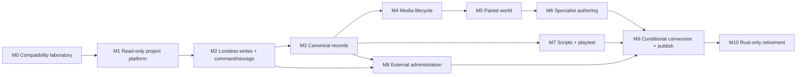

# Rust super editor implementation index

## Status

- **Stage**: `Plan`
- **Requirements authority**: [`rust-super-editor-engine-migration.md`](rust-super-editor-engine-migration.md)
- **Execution status**: decomposition complete; implementation not started
- **Last updated**: `2026-07-20`

## Purpose

This index turns the accepted product/program specification into an execution graph. It does not redefine product behavior, compatibility, or retirement criteria. When this index or a milestone workbook conflicts with the canonical specification, the canonical specification wins and the implementation artifact must be corrected.

The execution hierarchy is:

```text
canonical specification
└── implementation index (dependencies, status, traceability)
    ├── milestone workbooks (work packages and gates)
    └── capability packets (one reviewable change with exact proof)
```

## Delivery rules

1. One capability packet is the maximum unit of implementation review. A packet may be split further but may not silently absorb adjacent matrix rows.
2. Every packet names canonical task IDs, prerequisites, owned paths, baseline, RED proof where behavior changes, implementation outcome, verification commands, and matrix rows advanced.
3. Shared paths are leased/serialized. Disjoint packets may proceed in parallel only when they do not edit the same crate APIs, fixtures, generated files, or documentation rows.
4. A milestone exits from accepted packet evidence, not elapsed time, screenshots alone, or a broad “parity” assertion.
5. Any write-capable packet remains blocked until its format reaches the required compatibility level and the command/storage/root-confinement prerequisites are accepted.
6. Rust client/server parity dependencies are explicit blockers. The editor does not reinterpret an unready runtime contract locally.
7. New-format work exists only on the accepted-ADR branch. The default branch remains legacy-native.

## Dependency graph



M4 and the analysis-only portion of M7 may overlap after M3. M8 adapter work may overlap M4–M7 after its command, secret, and reconciliation prerequisites exist. M9 and M10 are convergence gates and do not begin speculatively.

## Milestone register

| Milestone | Workbook | Canonical tasks | Primary output | Status |
|---|---|---:|---|---|
| M0 | [`m0-compatibility-laboratory.md`](rust-super-editor/m0-compatibility-laboratory.md) | 1–8 | Matrices, corpus policy, baselines, ADR decisions | Planned |
| M1 | [`m1-read-only-project-platform.md`](rust-super-editor/m1-read-only-project-platform.md) | 9–19 | Root-confined project model and first real UI slice | Planned |
| M2 | [`m2-lossless-command-storage.md`](rust-super-editor/m2-lossless-command-storage.md) | 20–33 | Lossless writers, command/Ledger, crash-safe persistence, project shell | Planned |
| M3 | [`m3-canonical-records.md`](rust-super-editor/m3-canonical-records.md) | 34–43 | Authoring parity for canonical collections/settings | Planned |
| M4 | [`m4-media-lifecycle.md`](rust-super-editor/m4-media-lifecycle.md) | 44–49 | Unified registry/file import, repair, preview, deletion | Planned |
| M5 | [`m5-paired-world.md`](rust-super-editor/m5-paired-world.md) | 50–59 | Complete visual/gameplay zone authoring | Planned |
| M6 | [`m6-specialist-authoring.md`](rust-super-editor/m6-specialist-authoring.md) | 60–67 | Terrain/mesh/gubbin/font/audio capability dispositions | Planned |
| M7 | [`m7-scripts-playtest.md`](rust-super-editor/m7-scripts-playtest.md) | 68–74 | RSL workspace and isolated Rust playtest | Planned |
| M8 | [`m8-external-administration.md`](rust-super-editor/m8-external-administration.md) | 75–80 | Permissioned MySQL/account administration | Planned |
| M9 | [`m9-conversion-publication.md`](rust-super-editor/m9-conversion-publication.md) | 81–88 | CLI, conditional migration, Rust publication | Planned |
| M10 | [`m10-retirement.md`](rust-super-editor/m10-retirement.md) | 89–95 | Rust-only cutover and legacy removal approval | Planned |

## Starting implementation sequence

The four starting increments are decomposed into independently accepted capability packets in [`starting-increments.md`](rust-super-editor/starting-increments.md):

1. `SE-0001` — evidence baseline and decision scaffolding;
2. `SE-0002` — headless root-confined project spine;
3. `SE-0003` — disposable UI/render/accessibility spike;
4. `SE-0004` — first production read-only Ledger slice.

No packet is `Ready` until an implementation owner and owned-path lease are recorded. `SE-M0-P01` is the first assignable packet. Later packets follow their declared prerequisites; the UI spike may overlap the later headless packets once its workspace/budget prerequisites are accepted, while the production slice waits for all M1 foundations.

## Traceability contract

Each canonical task appears in exactly one milestone workbook. Each workbook maps it to one or more packet IDs. `bash scripts/check_super_editor_plan.sh` checks:

- all canonical task numbers `1..95` occur exactly once in workbook `Canonical tasks` declarations;
- each named milestone workbook declares its exact canonical range;
- every workbook has the required Identity, Outcome, Verification, Exit gate, and Non-goals sections;
- all local Markdown links resolve.

Packet dependencies and owned-path conflicts are reviewed when a packet moves from `Planned` to `Ready`; they are not inferred from prose by the checker.

## Program-level evidence ledger

| Evidence | Created by | Consumed by |
|---|---|---|
| Project-format matrix | M0 | M1–M10 |
| Editor-capability matrix | M0 | M3–M10 |
| State/output-classification matrix | M0 | M1, M2, M4, M7–M10 |
| Client/server parity dependency ledger | M0, updated each milestone | M1–M10 |
| Sanitized project corpus | M0, expanded continuously | Every format/writer/migration gate |
| ADR set | M0 plus bounded later decisions | Owning packets |
| Compatibility-level advancement | Each format packet | Dependent write packets |
| Capability disposition evidence | M3–M8 | M9/M10 |
| Clean-machine rehearsal | M9/M10 | Retirement approval |

## Status vocabulary

- `Planned`: decomposed but prerequisites not yet accepted.
- `Ready`: prerequisites and owned-path lease are satisfied.
- `In progress`: one owner is executing the packet.
- `Review`: implementation evidence is complete and independent review is pending.
- `Accepted`: verification and review pass; declared matrix rows advance.
- `Blocked`: a named external dependency prevents progress.
- `Rejected`: the packet approach was invalidated; replacement decision is recorded.

## Change control

- Product scope changes update the canonical specification first, then this index/workbooks.
- Sequencing or packet-boundary changes update this index/workbooks and append their changelog.
- Implementation discoveries update the relevant matrix and packet; they do not silently weaken acceptance criteria.
- Milestone completion moves its workbook to the appropriate later stage only when the canonical exit gate is proven.

## Changelog

- `2026-07-20`: Initial implementation decomposition created from the adversarially accepted 95-task migration specification.
- `2026-07-20`: Adversarial execution review split the first four increments into independently owned M0/M1 packets, completed security/compatibility/tool coverage, added exact-range verification, and reached three-lens acceptance.
